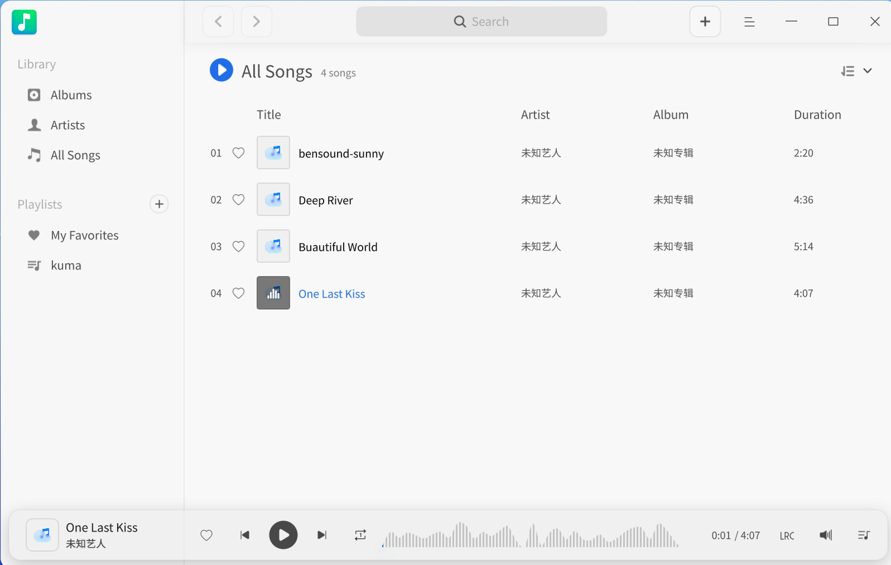
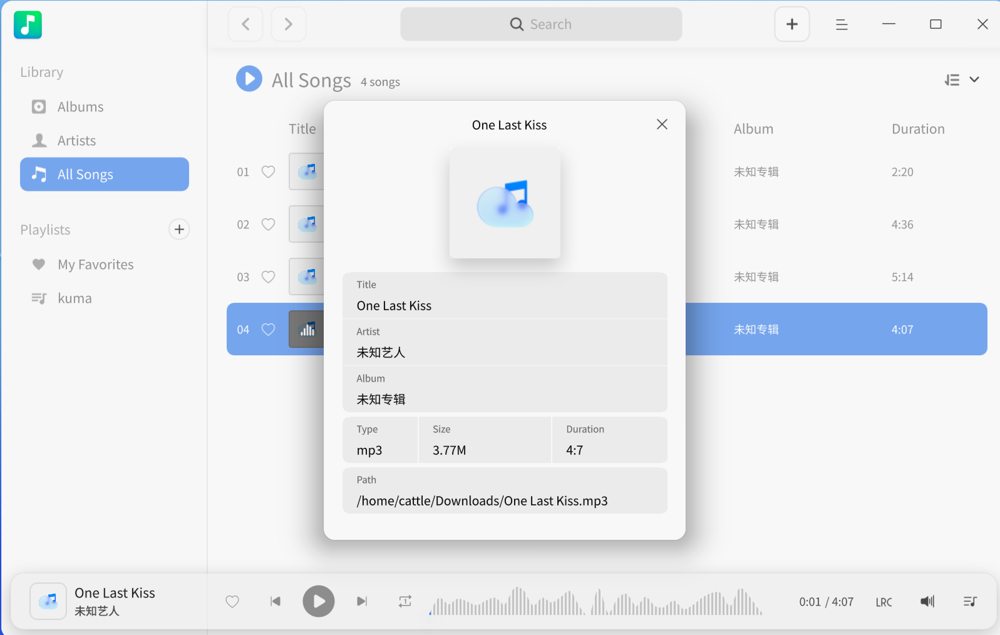

# Music | deepin-music

## Overview

Music is an application focused on local music playback, providing you with a brand-new interface design, an exceptional playback experience, along with features like scanning local music and synchronized lyrics.

## Getting Started

Run or close Music through the following methods, and create shortcuts.

### Run Music

1. Click the Launcher icon  on the taskbar to enter the Launcher interface.
2. Scroll the mouse wheel or search to find the Music icon , then click to run.
3. Right-click  to:
   - Click **Send to Desktop** to create a desktop shortcut.
   - Click **Pin to Taskbar** to pin the application to the taskbar.
   - Click **Startup Automatically** to add the application to startup items, automatically running it when the computer boots.

>  Note: If Music is already pinned to the taskbar by default, you can also click the taskbar icon  to run it.

### Hide to System Tray

In the Music interface, click  > **Settings**, then check **Minimize to System Tray**. Each time you close the main window, Music will automatically hide in the system tray. Right-click the tray icon to:
- Play/Pause.
- Previous.
- Next.
- Quit.

### Close Music

- In the Music interface, if you set "Close main window" to "Exit", click  to quit Music.
- Right-click  in the system tray and select **Quit**.
- Right-click  on the taskbar and select **Close All**.

### View Shortcuts

In the Music interface, use the shortcut **Ctrl + Shift + ?** to open the shortcut preview. Mastering shortcuts will significantly improve your efficiency.

## Interface Introduction

Perform playback operations, view playlists, lyrics, etc., through interface buttons.

| No. | Name             | Description                                                  |
|-----|------------------|--------------------------------------------------------------|
| 1   | Search Box       | Quickly find music via the search box.                       |
| 2   | Add Music        | Add music files to the playlist.                             |
| 3   | Main Menu        | Add new playlists, add music, configure settings, view help, quit, etc. |
| 4   | Sort By          | Sort songs by: Date Added, Title, Artist, Album (default: Date Added). |
| 5   | Previous/Next    | Switch to the previous/next track.                           |
| 6   | Play/Pause       | Play or pause the song.                                      |
| 7   | Playback Box     | Displays the current song's title, cover, and artist.        |
| 8   | Favorite         | Add music to "My Favorites"; click again to remove.          |
| 9   | Lyrics           | Toggle lyrics display; click again to exit.                  |
| 10  | Playback Mode    | Cycle modes: List Loop, Single Loop, Shuffle.                |
| 11  | Volume Control   | Adjust volume level.                                         |
| 12  | Play Queue       | Open the play queue.                                         |

## Common Operations

Add, delete, and view information for local music.

>  Note: Supported features vary by decoding technology; refer to the actual interface.

### Add Music

In the Music interface, add music via:
- Click the Add button  on the title bar.
- Click  > **Add Music**.
- Drag music files directly into the interface.

>  Note: If no music exists, click **Add Music**, **Add Song Path**, or **Scan** music directories. Right-click library/playlist items to add music when songs are present.

### Search Music

1. In the search box, click  and enter keywords.
2. Press **Enter** to search.
3. Click  or delete text to clear/cancel the search.

### Play Music

Play music via:
- Double-click a song or right-click and select **Play**.
- Click **Play All** to play all songs in the current list.
- Right-click a playlist and select **Play** to play all songs in it.

>  Tip: Click  to play selected songs;  to pause;  or  to skip tracks per playback mode.

### Favorite Music

1. Play a song.
2. Click  to add it to "My Favorites".

>  Tip: Right-click a song > **Add to Playlist** > **My Favorites**.

### View Lyrics

Click  or  to toggle lyrics display.

>  Note: If a song has a cover,  becomes the cover; click it to view lyrics.

### Adjust Playback Mode

Click  (Single Loop),  (Shuffle), or  (List Loop).

### Open in File Manager

1. Right-click a song.
2. Select **Open in File Manager** to locate its storage path.

### Delete Music

Right-click a song in the playlist:
- **Remove from Playlist** > **Remove**: Removes from the list but keeps the local file.
- **Delete from Disk** > **Delete**: Permanently deletes the file.

### Set Encoding

Fix garbled text by changing encoding:
1. Right-click a song.
2. Select **Encoding** and choose an alternative.

### View Song Info

1. Right-click a song.
2. Select **Song Info** to view details.

## Playlist Management

Create, rename, delete playlists, or add songs to playlists.

>  Note: **All Songs** (default, undeletable) contains every song. Manage favorites directly or via the toolbar.

### Add New Playlist

1. Click  next to "My Playlists" or  > **Add New Playlist**.
2. Enter a name and press **Enter**.

### Rename Playlist

1. Select a playlist under "My Playlists".
2. Right-click and select **Rename**.
3. Enter a new name and press **Enter**.

### Add Songs to Playlist

1. Right-click a song.
2. Select **Add to** > [Playlist Name].

>  Tip: Drag songs directly into a playlist.

### Remove Songs from Playlist

1. Select a song under a playlist.
2. Right-click and select **Remove from Playlist**.

### Delete Playlist

1. Right-click a playlist under "My Playlists".
2. Select **Delete** > **Delete** in the dialog.

## Main Menu

Add playlists, add music, adjust equalizer, configure settings, switch themes, view help, etc.

### Equalizer

Adjust audio quality for optimal sound:
1. Click  > **Equalizer**.
2. Enable **Equalizer**, customize "Preamp" and frequency bands, then click **Save**. Or select a preset mode (auto-saved).
3. Click **Restore Defaults** to reset.

### Settings

#### Basic Settings
1. Click  > **Settings**.
   - **Playback**:
     - **Auto-play on startup**: Play music when Music launches.
     - **Remember last playback position**: Resume progress on startup.
     - **Enable fade in/out**: Gradual volume change when starting/stopping playback.
   - **Close Main Window**:
     - **Minimize to system tray**: Hide to tray when closed.
     - **Exit**: Quit the application.
     - **Ask every time**: Confirm before closing.

#### Shortcut Settings
1. Navigate to **Settings** > **Shortcuts**.
2. View or customize shortcuts.

### Theme
Switch themes (Light, Dark, System):
1. Click  > **Theme**.
2. Select a theme.

### Help
View the help manual:
1. Click  > **Help**.

### About
View version and info:
1. Click  > **About**.

### Exit
Quit Music:
1. Click  > **Exit**.