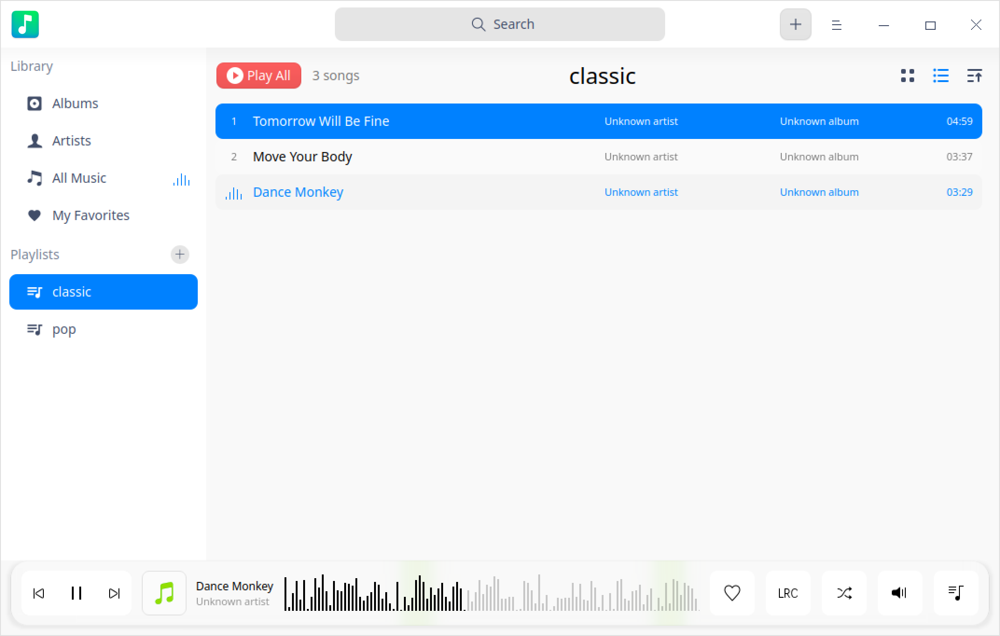
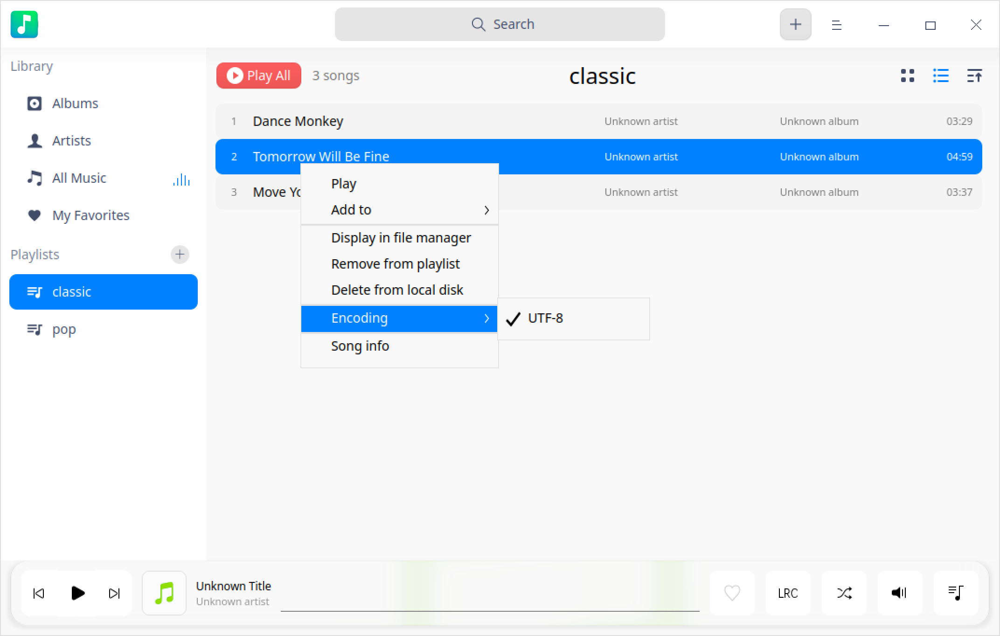
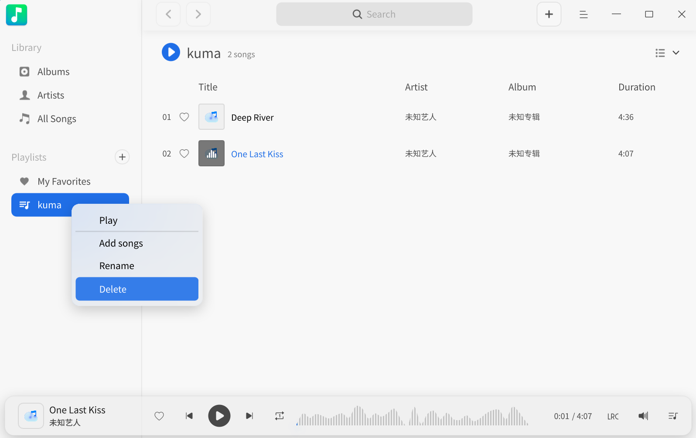

# Music|deepin-music|

## Overview

Music is a local music playing application with brand-new UI design and state-of-the-art playing experience featured with local music scanning and lyric sync functions, etc.

## Guide

You can run, close, and create a shortcut for Music in the following ways.

### Run Music

1. Click  in the dock to enter the Launcher interface.
2. Locate  by scrolling mouse wheel or searching "music" in the Launcher interface.
3. Right-click the Music application icon and you can:
 - Click **Send to desktop** to create a desktop shortcut.
 - Click **Send to dock** to fix the application on dock.
 - Click **Add to startup** to add the application to startup and it will automatically run when the system starts up.

>  Notes: If Music has been fixed in the Dock, you can also click  in the Dock to run it.

### Minimize to System Tray

Music can be minimized to the system tray.

- Click  > **Settings** on the music interface and check **Minimize to system tray**. Music will be minimized directly to the system tray each time you close the main window. 
- Click  on the Music interface to close the main window, select **Minimize to system tray** and click **Confirm**.

  >  Notes: Check **Minimize to system tray** and **Do not ask again** and the pop-up window will no longer be displayed.

Right-click the Music application icon in the tray and you can perform the following operations:

 - Click **Play/Pause** to play/pause the song.
 - Click **Previous** to play the previous song.
 - Click **Next** to play the next song.
 - Click **Exit** to exit Music.

### Exit Music

- On the Music interface, click  and select **Exit** to exit Music or click to exit music directly if you have checked the **Exit** option in the **Close Main Window** option.  
- Right-click the Music application icon  in the Dock and select **Close All** to exit Music.
- Right-click  in the system tray and select **Exit** to exit Music. 

### View Shortcuts

On the Music interface, press **Ctrl** + **Shift** + **?**  to view the shortcuts. Proficiency in shortcuts will greatly improve your efficiency.

## Main Interface

On the main interface, you can choose from regular options, check view playlist, and get song info.

<table class="block1">
    <caption></caption>
    <tbody>
        <tr>
            <td>1</td>
            <td>Search box</td>
            <td>You can search music quickly by search box.</td>
        </tr>
        <tr>
            <td>2</td>
            <td>Main menu</td>
            <td>You can add playlist, add music, set options, view manual and about information, and exit the application via main menu.</td>
        </tr>
    	<tr>
            <td>3</td>
            <td>Sort options</td>
            <td>You can sort the list by different types of order including time added, title, artist, or album name.</td>
        </tr>
    	<tr>
            <td>4</td>
            <td>Previous/Next</td>
            <td>Click to switch to Previous/Next music.</td>
        </tr>
    		<tr>
            <td>5</td>
            <td>Play/Pause button</td>
            <td>Click to Play/Pause music.</td>
        </tr>
    	<tr>
            <td>6</td>
            <td>Play box</td>
            <td>Show the name of the song being played, the cover, and the artist name.</td>
        </tr>
    	<tr>
            <td>7</td>
            <td>Favorite</td>
            <td>Click to add music to my favorites and click again to unfavorite it.</td>
        </tr>
    	<tr>
            <td>8</td>
            <td>Lyrics</td>
            <td>Click it to switch to the lyrics interface and click it again to exit the lyrics interface.</td>
        </tr>
    		<tr>
            <td>9</td>
            <td>Play mode</td>
            <td>Click it to switch to the play mode, including list loop, single loop, and shuffle.</td>
        </tr>
    		<tr>
            <td>10</td>
            <td>Volume</td>
            <td>Click it and drag the volume bar to adjust the volume.</td>
        </tr>
    		<tr>
            <td>11</td>
            <td>Play Queue</td>
            <td>Click it to show/hide the playlist.</td>
        </tr>
    </tbody>
</table>

## Common Operations

You can add, delete, and view info of the local music in Music in the following ways.

### Add Music

On the Music interface, you can: 
- Click **Add Music**, and add local music to the playlist, or click **Scan** to add music if there is no music file in Music.
- Click **Open Folder** to customize the local song directory, and add music files in batch if there is no music file in Music.
- Click > **Add music** to add music files to the playlist.
- Drag the music file/folder to the Music interface, and add the music file to the playlist.

>  Notes: If you are using a computer equipped with touch-screen or touchpad, hold down the music file with one finger and drag it to the Music interface to add music.

### Search Music

1. In the search box on top of the Music interface, you can click  to enter keywords.

2. Press the **Enter** key on the keyboard to conduct search.

3. Click  or delete the entered information in the search box to clear the current information or cancel the search.

### Play Music

You can play music in the following ways:

- Select a music in the playlist, and double-click or right-click it to select **Play** to play the music.
- Select a list under the playlist in the left navigation bar. Right-click and select **Play** to play all the songs in the list according to the current order.
- Click **Play All** to play all the songs in the current list according to the current order. 

>  Tips: On the Music interface, click  to play the selected music. Click  to pause the play. Click  or  to switch to the previous or the next song according to the current play mode.

### Add Music to My Favorites

On the Music interface, click  to add music to My Favorites.

The prompt information **Successfully added to "My favorites"** pops up and the music is added to **My Favorites** list.

>  Tips: You can also right-click the music, and select **Add to playlist** > **My favorites** to add the music to **My Favorites** list.

### View Lyrics

On the Music interface, you can:

- Click  to switch to the lyrics interface. Click it again to fold the lyrics interface.

- Click to switch to the lyrics interface. Click it again to fold the lyrics interface.

>  Notes:  If the music being played has a cover picture,  will be displayed as the cover picture. Click it to switch to the lyrics interface.

### Adjust Play Mode

On the Music interface, click  ,   or  to adjust the play mode.

: Single loop

: Shuffle

: List loop

### Display in File Manager

1. On the Music interface, right-click the music.
2. Click **Display in file manager** and you can view the music file in File Manager.

### Delete Music

On the Music interface, right-click the music and you can:

- Click **Remove from playlist** to remove the music from the playlist, but the music file will still be saved on the local disk.
- Click **Delete from local disk** to remove the music both from the playlist and the local disk. 

### Select Encoding

For music with garbled characters, you can make it display normally by switching the encoding methods.

1. On the Music interface, right-click the music.
2. Click **Encoding**, and select the encoding as needed.

### View Music Info

1. On the Music interface, right-click the music file in the playlist.
2. Click **Song info** to view the music title, artist, album, type, size, duration, path, and other information.

## Playlist Management

On the Music interface, you can create, delete, and rename playlist. You can also add music to the playlist.

>  Notes: **All music** and **My Favorites** are set as default playlists and cannot be deleted. Custom playlists are subsets of the **All Music** playlist. **My Favorites** playlist can be managed directly or through the Favorite icon on the main interface.

### Create New Playlist

1.  On the Music interface, click  right to the **Playlists**, or click > **Add playlist**.
2.  Enter the name of the playlist.
3.  Press the **Enter** key on keyboard.

### Rename Playlist

1.  Select a playlist from **Playlists**.
2.  Right-click and select **Rename**.
3.  Enter the name of the playlist, and press the **Enter** key on keyboard to save it.

### Add Music to Playlist

1. On the Music interface, select the music you want to add.
2. Right-click and select **Add to playlist** to add the music to the selected playlist.

> Tips: You can drag the local music to a specified playlist to add the music into the current playlist and **All Music** playlist. 

### Remove Music from Playlist

1. Select a playlist from **Playlists**, and select the music you want to remove from it.
2. Right-click and select **Remove from playlist** to remove the music from the playlist.

### Delete Playlist

1. Select a playlist from **Playlists**. 
2. Right-click the playlist to be deleted, and select **Delete**.
3. In the pop-up window, select **Delete** to confirm the operation.

## Main Menu

In the main menu, you can [Add Music](#Add Music), create new playlists, set the equalizer and the options, switch window themes, view help manual, and get more information about Music.

### Equalizer

You can set your favorite music mode, such as classical, rock, and so on. 

1. On the Music interface, click .
2. Select **Equalizer**.
3. You can switch on equalizer, customize **Preamplifier** values and frequencies, and click **Save**; or select a music mode from the drop-down list which will be automatically saved by the system.
4. Click **Restore Defaults** to restore the default settings.

### Settings

You can set the basic information and shortcuts in settings.

#### Basic Settings

1. On the Music interface, click .
2. Select **Settings** > **Basic**.
    - In the option **Play**, you can:
        - Check the **Autoplay** box, and the music will be played automatically when Music runs.
        - Check the **Remember playback position** box, and the music will be played automatically from the last position played when Music runs.
        - Check the **Enable fade in/out** box, and the music will fade in and out when Music runs.
    - In the option **Close Main Window**, you can:
        - Select **Minimize to system tray** to close the main window, and hide Music to system tray.
        - Select **Exit** to close the main window, and exit Music. 
        - Select **Ask me always** to prompt system notification, and confirm whether to exit Music when the main window is closed.
3. Click **Restore Defaults** to restore the default settings.

#### Shortcuts

1. On the Music interface, click .
2. Select **Settings** > **Shortcuts** to view the shortcuts.
3. You can select and re-enter shortcut keys to customize your choice.

### Theme

The window theme provides three theme types, namely Light Theme, Dark Theme, and System Theme.

1. On the Music interface, click .
2. Click **Theme** to select one theme.

### Help

1. On the Music interface, click .
2. Click **Help** to view the manual of Music.

### About

1. On the Music interface, click .
2. Click **About** to view the version and introduction of Music.

### Exit

1. On the Music interface, click .
2. Click **Exit** to exit Music.