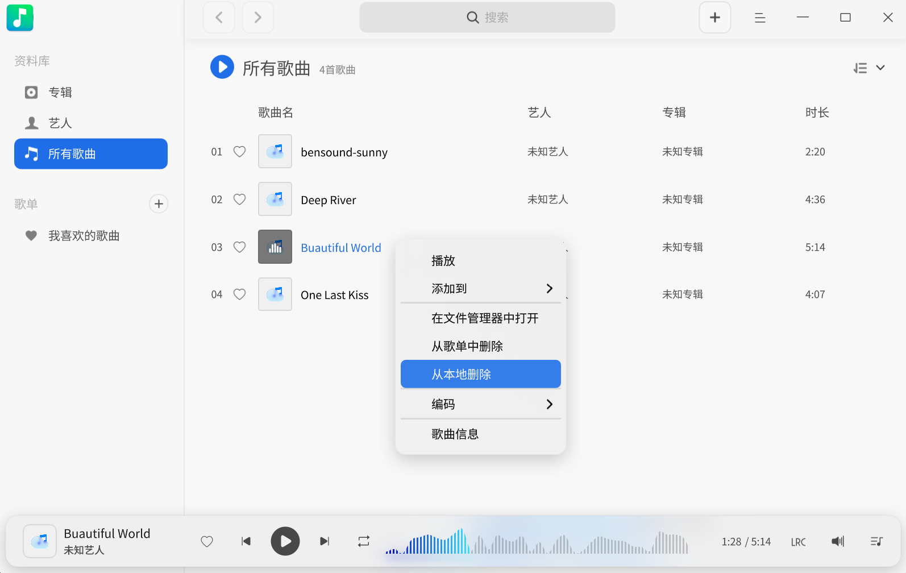
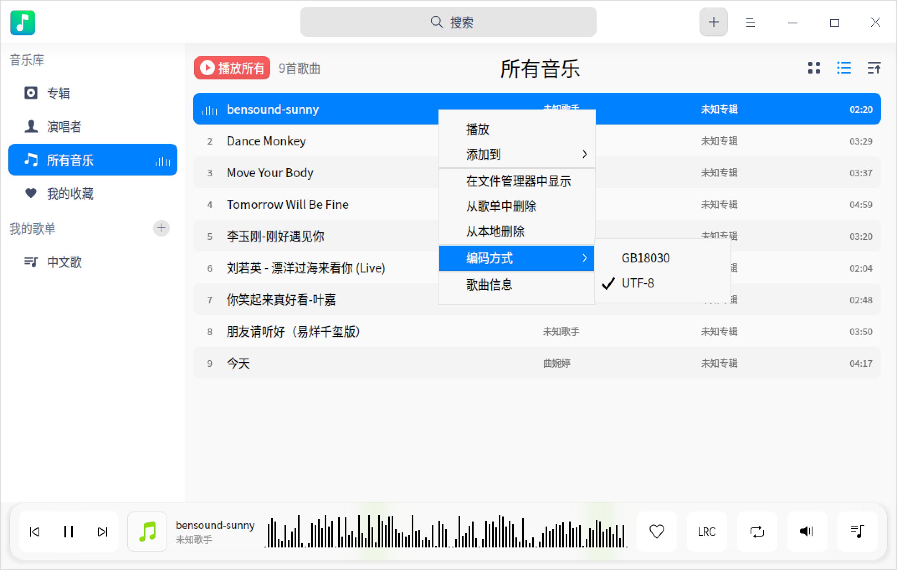
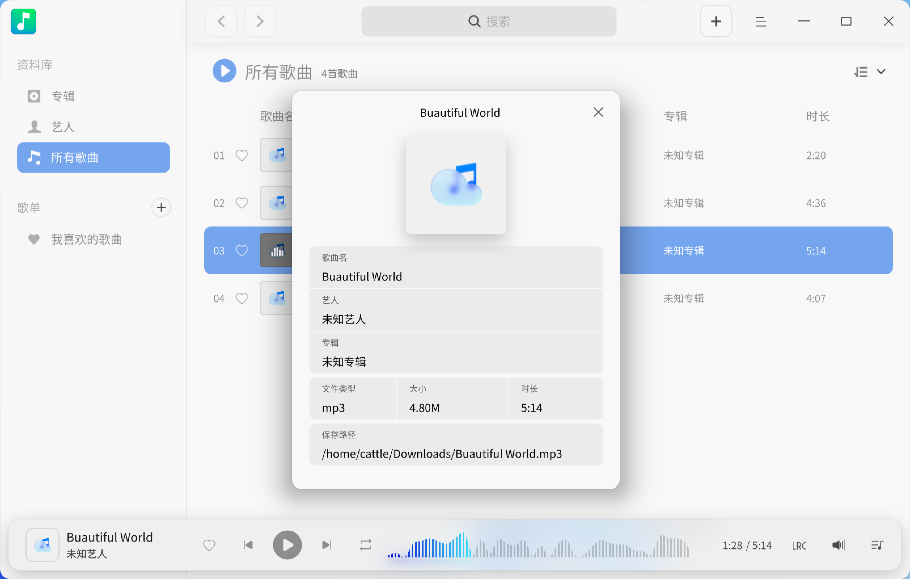
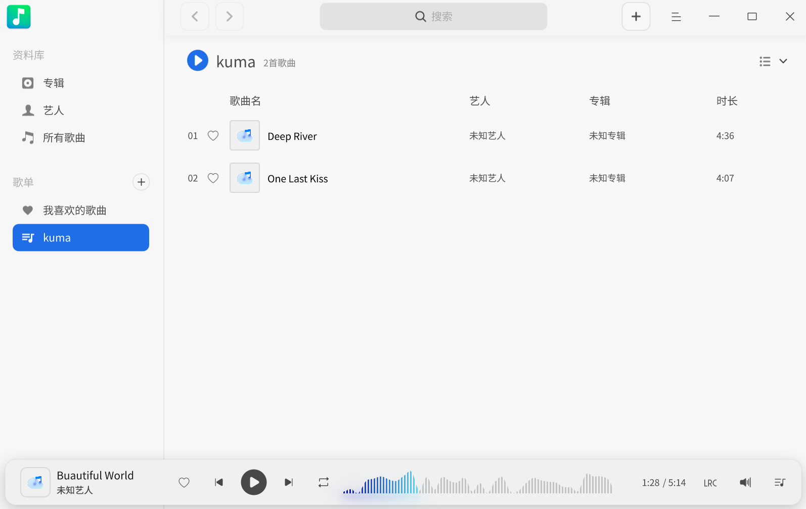
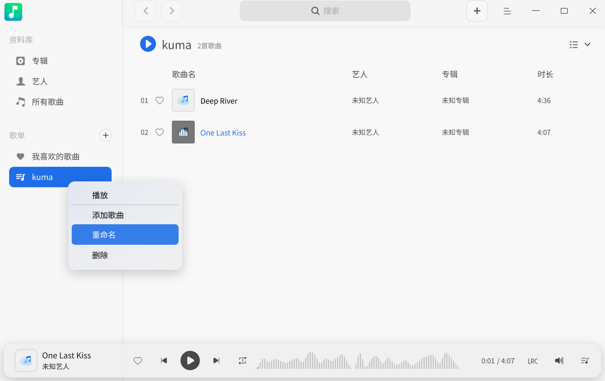

# 音乐|deepin-music|

## 概述

音乐是一款专注于本地音乐播放的应用程序，为您提供全新的界面设计、极致的播放体验，同时还具有扫描本地音乐、歌词同步等功能。

## 使用入门

通过以下方式运行、关闭音乐，同时还可以创建快捷方式。

### 运行音乐

1. 单击任务栏上的启动器图标，进入启动器界面。
2. 上下滚动鼠标滚轮浏览或通过搜索，找到音乐图标 ，单击运行。
3. 右键单击 ，您可以：
   - 单击 **发送到桌面**，在桌面创建快捷方式。
   - 单击 **发送到任务栏**，将应用程序固定到任务栏。
   - 单击 **开机自动启动**，将应用程序添加到开机启动项，在电脑开机时自动运行该应用。

> 说明：如果音乐已经默认固定在任务栏上，您也可以单击任务栏上的图标  来运行。

### 隐藏到系统托盘

在音乐界面，单击  > **设置** ，勾选 **最小化到系统托盘** 后，每次关闭主窗口时，音乐会自动隐藏到系统托盘中。您可以右键单击托盘中的图标选择：

- 播放/暂停。
- 上一首。
- 下一首。
- 退出。

### 关闭音乐

- 在音乐界面，如果您设置关闭主窗口的操作是退出，可以单击 ，退出音乐。
- 右键单击系统托盘中的 ，选择 **退出**，退出音乐。
- 右键单击任务栏上的 ，选择 **关闭所有**，退出音乐。

### 查看快捷键

在音乐界面，使用快捷键 **Ctrl + Shift + ?** 打开快捷键预览界面，熟练地使用快捷键，将大大提升您的操作效率。

## 界面介绍

通过界面按钮可以进行常规的播放操作，查看播放列表和歌曲歌词信息。

| 标号 | 名称          | 说明                                                         |
| ---- | ------------- | ------------------------------------------------------------ |
| 1    | 搜索框        | 通过搜索框快速查找音乐。                                     |
| 2    | 主菜单        | 通过菜单栏您可以添加新歌单、添加音乐、设置音乐、查看帮助手册、退出音乐等。 |
| 3    | 排序方式      | 对歌曲进行排序，排序方式包括：添加时间、歌曲名称、歌手名称、专辑名称。 默认按添加时间排序。 |
| 4    | 上一首/下一首 | 切换到上一首/下一首音乐。                                    |
| 5    | 播放/暂停按钮 | 播放/暂停歌曲。                                              |
| 6    | 播放框        | 显示当前播放的歌曲名、封面、歌手。                           |
| 7    | 收藏          | 将喜欢的音乐添加到我的收藏列表中，再次单击可以取消收藏。     |
| 8    | 歌词          | 切换到歌词界面，再次单击退出歌词界面。                       |
| 9    | 播放模式      | 切换播放模式，包括：列表循环、单曲循环、随机播放。           |
| 10   | 音量调节      | 调节音量大小。                                               |
| 11   | 播放队列      | 打开播放队列。                                               |

## 常用操作

您可以在音乐中对本地音乐进行添加、删除、查看信息等基本操作。

### 添加音乐

通过以下方法之一添加音乐到音乐播放器中：
- 在音乐界面，如果还没有音乐文件，单击 **添加歌曲文件** 选择本地音乐文件；或单击 **扫描** 添加音乐。
- 在音乐界面，如果还没有音乐文件，单击 **添加歌曲路径** 选择本地的歌曲目录，批量添加歌曲文件。
- 在音乐界面，单击  > **添加音乐**。
- 直接将音乐文件/文件夹拖拽到音乐界面。
  
> 说明：当使用触控屏或触控板电脑时，一指按住音乐文件拖拽到音乐界面即可添加音乐。

### 搜索音乐

1. 在音乐界面搜索框中，单击 ，输入关键字。   
2. 按下键盘上的 **Enter** 键进行搜索。
3. 在搜索框中单击  或删除输入的信息，即可清除当前输入的信息或取消搜索。

### 播放音乐

通过以下方法之一播放音乐：

- 在音乐列表，双击歌曲或右键单击歌曲并选择 **播放** ，播放当前歌曲。
- 在音乐列表，单击 **播放所有**，按照当前设置的播放顺序播放当前列表中所有歌曲。
- 选择一个歌单，右键单击 **播放**，按照当前设置的播放顺序播放当前歌单中所有歌曲。

> 窍门：在音乐界面，单击  播放选中的歌曲；单击  暂停正在播放的歌曲；单击  或 ，按照当前播放模式切换到上一首或下一首歌曲。

### 收藏音乐

1. 在音乐界面，播放某一个音乐文件。
2. 单击工具栏中的 ，收藏当前音乐到“我的收藏”列表中。

> 窍门：您也可以右键单击音乐文件，选择 **添加到歌单** > **我的收藏**，该音乐会被收藏到“我的收藏”列表中。

### 查看歌词

在音乐界面，您可以：

- 单击工具栏上的图标  切换到歌词界面，再次单击，收起歌词界面。
- 单击工具栏上的图标  切换到歌词界面，再次单击，收起歌词界面。

>  说明：如果播放的音乐文件有封面图，那么图标 将转换为该音乐文件的封面图，单击封面图也可以切换到歌词界面。

### 调整播放模式

在音乐界面，单击  或  或  调整播放模式。

其中：

：单曲循环

：随机播放

：列表循环

### 在文件管理器中显示

1. 在音乐界面，右键单击音乐文件。
2. 选择 **在文件管理器中显示**，定位该音乐的存储位置。

### 删除音乐

在播放列表中，右键单击要删除的音乐文件：

- 选择 **从歌单中删除**，在弹出的对话框中单击 **移除**，该音乐文件会从歌曲列表中移除，但仍保留在本地文件夹中。
- 选择 **从本地删除**，在弹出的对话框中单击 **删除**，该音乐文件会从歌曲列表和本地文件夹中一并删除。

### 设置编码方式

对有乱码显示的歌曲，通过切换编码方式以使其正常显示。

1. 在播放列表中，右键单击音乐文件。
2. 单击 **编码方式**，选择一种编码方式。

### 查看音乐信息

1. 在播放列表中，右键单击音乐文件。
2. 选择 **歌曲信息**，查看歌曲名称、歌手名称、专辑、文件类型、文件大小、时长、文件路径等信息。

## 歌单管理

您可以在音乐界面进行新建歌单、重命名歌单、删除歌单、将音乐添加到我的歌单等操作。

> 说明：**所有音乐** 和 **我的收藏** 是默认列表，不能删除。**所有音乐** 包含各个歌单的全部音乐。您既可以在 **我的收藏** 列表中直接管理收藏的歌曲，也可以通过主界面上的收藏按钮管理。

### 新建歌单

1. 在音乐界面，单击“我的歌单”右侧的按钮  或者  > **添加新歌单**。
2. 输入歌单名称后按下键盘上的 **Enter** 键保存。

### 重命名歌单

1. 在“我的歌单”列表中选择一个歌单。
2. 单击鼠标右键选择 **重命名**。
3. 输入新名称后按下键盘上的 **Enter** 键保存。

### 添加音乐到歌单

1. 在音乐界面，选择一个音乐文件。
2. 单击鼠标右键。
3. 选择 **添加到歌单**，将歌曲添加到选定的歌单。  

> 窍门：您可以拖拽本地歌曲到某一指定歌单，即将歌曲添加到了当前歌单和所有音乐中。

### 移除歌单中的音乐

1. 在“我的歌单”中选择一个歌单，选择该歌单下的音乐文件。
2. 单击鼠标右键。
3. 选择 **从歌单中删除**，将选中的音乐文件从歌单中移除。

### 删除歌单

1. 在“我的歌单”中，选择要删除的歌单。
2. 单击鼠标右键，选择 **删除**。
3. 在弹出的对话框中单击 **删除**。

## 主菜单

在主菜单中，您可以[添加音乐](#添加音乐)、新建歌单、调节均衡器、设置音乐信息、切换窗口主题、查看帮助手册、了解音乐的更多信息。

### 均衡器

在均衡器中调节音频质量，使其达到理想的音效。

1. 在音乐界面，单击  。
2. 选择 **均衡器**。
3. 开启 **均衡器** 后，自定义调节“前置放大”增益值和频率波段后单击 **保存**，或者在模式的下拉框中选择一种音乐模式，系统会自动保存设置。
4. 单击 **恢复默认**，将设置恢复到默认状态。

### 设置

#### 基础设置

1. 在音乐界面，单击 。
2. 选择 **设置**，您可以进行如下操作。
   - 在 **播放** 选项：
      - 勾选 **启动时自动播放**，在音乐启动后自动播放音乐。
      - 勾选 **启动时记住上次播放进度**，在音乐启动后接续上次进度播放。
      - 勾选 **开启淡入淡出**，播放音乐时声音缓缓变大，退出音乐时声音渐渐变小。
   - 在 **关闭主窗口** 选项：
      - 选择 **最小化到系统托盘**，关闭主窗口时，应用将隐藏到系统托盘。
      - 选择 **退出**，关闭主窗口时直接退出应用。
      - 选择 **每次询问**，每次关闭主窗口时会弹出确认弹窗。
3. 单击 **恢复默认**，将音乐的设置恢复到默认状态。

#### 快捷键设置

1. 在音乐界面，单击 。
2. 选择 **设置**。
3. 在 **快捷键** 选项查看当前快捷键，您也可以定义快捷键。

### 主题

窗口主题包含浅色主题、深色主题和系统主题。

1. 在音乐界面，单击。
2. 选择 **主题**，选择一种主题颜色。

### 帮助

查看帮助手册，进一步了解和使用音乐。

1. 在音乐界面，单击  。
2. 选择 **帮助**。
3. 查看音乐的帮助手册。

### 关于

1. 在音乐界面，单击  。
2. 选择 **关于**。
3. 查看音乐的版本和介绍。

### 退出

1. 在音乐界面，单击 。
2. 选择 **退出**。
