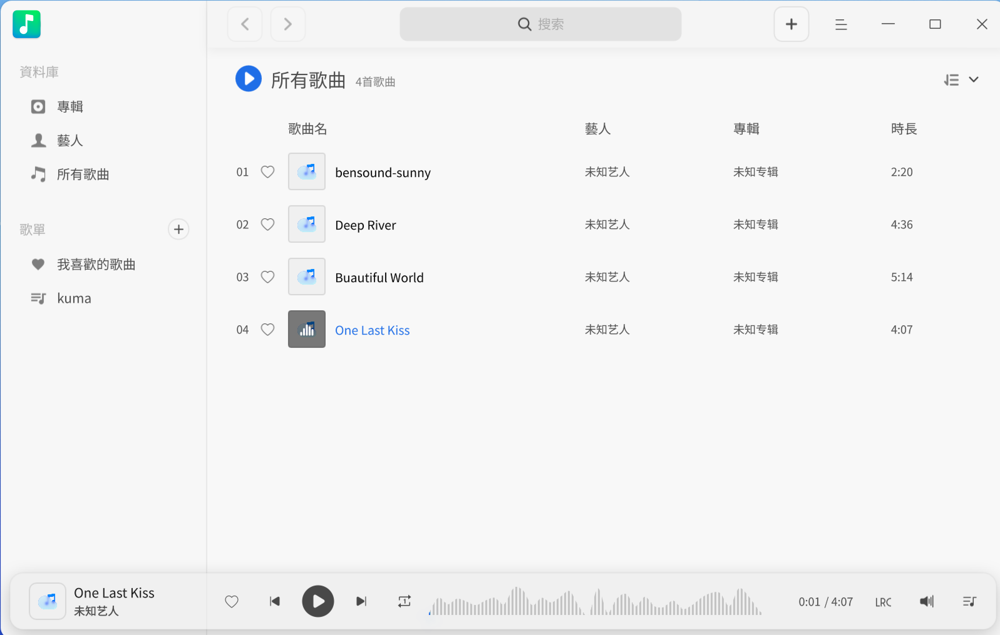
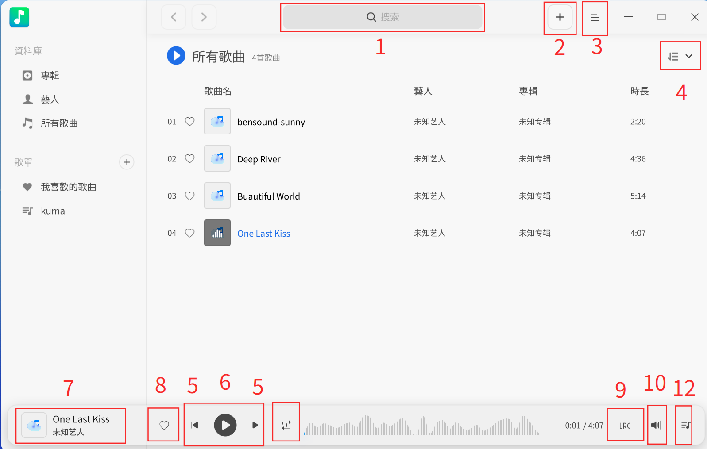
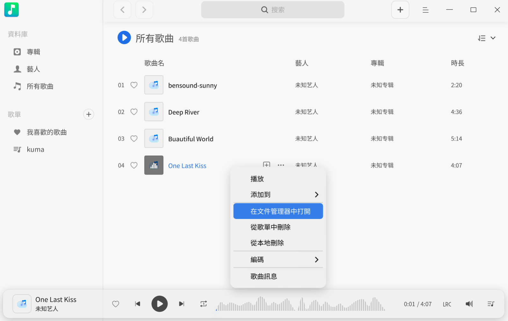
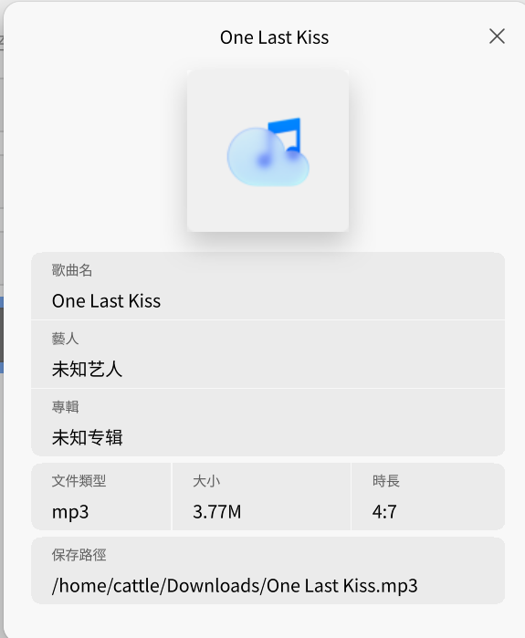
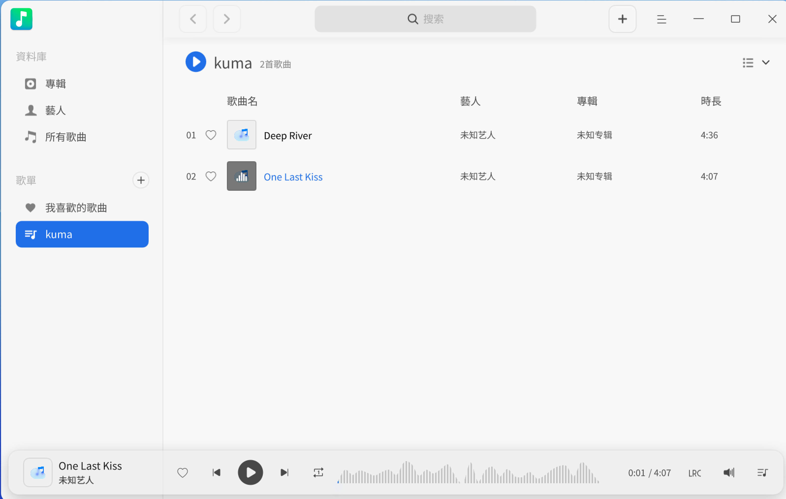
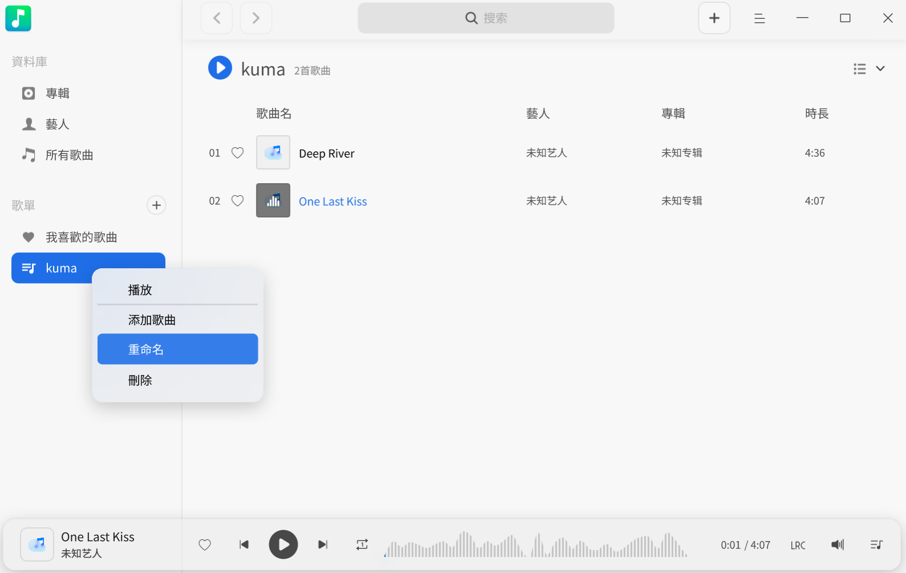
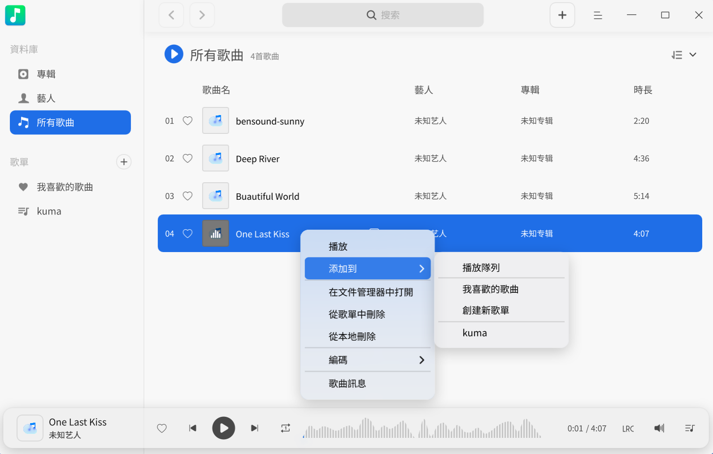
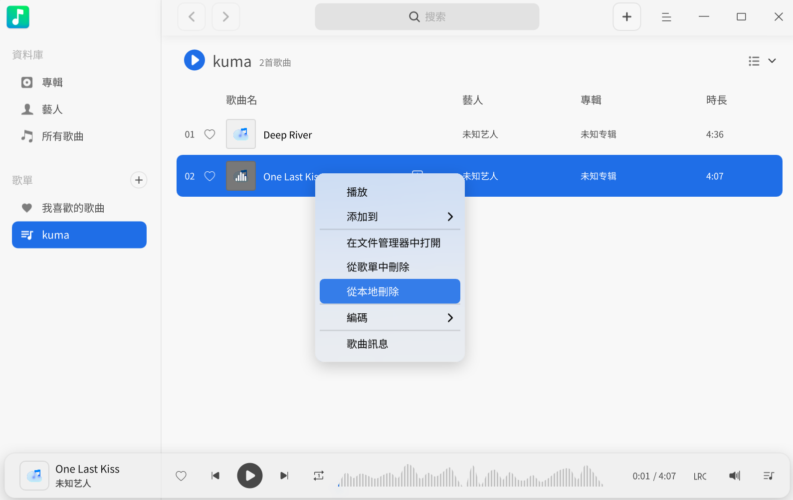
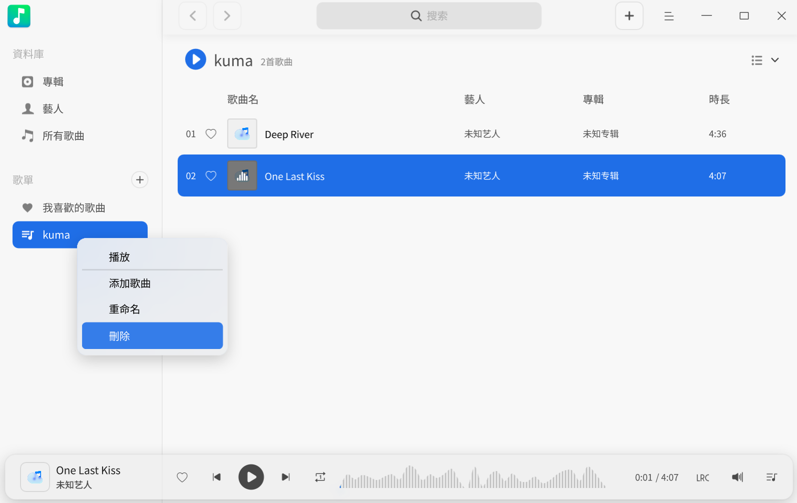

# 音樂|deepin-music|

## 概述

音樂是一款專注於本地音樂播放的應用程式，為您提供全新介面設計、極致播放體驗，同時具備掃描本地音樂、歌詞同步等功能。

## 使用入門

透過以下方式執行或關閉音樂，同時可建立捷徑。

### 執行音樂

1. 按一下工作列上的啟動器圖示 ，進入啟動器介面。
2. 上下滾動滑鼠滾輪或搜尋，找到音樂圖示 ，按一下執行。
3. 右鍵按一下 ，您可以：
   - 按一下 **傳送到桌面**，在桌面建立捷徑。
   - 按一下 **釘選到工作列**，將應用程式固定到工作列。
   - 按一下 **開機自動啟動**，將應用程式加入開機啟動項，電腦開機時自動執行。

>  說明：若音樂已預設固定在工作列，您亦可按一下工作列圖示  執行。

### 隱藏至系統匣

在音樂介面，按一下  > **設定** ，勾選 **最小化至系統匣** 後，關閉主視窗時音樂會自動隱藏至系統匣。右鍵按一下匣中圖示可：
- 播放/暫停。
- 上一首。
- 下一首。
- 退出。

### 關閉音樂

- 在音樂介面，若設定關閉主視窗為「退出」，按一下  即可退出。
- 在系統匣右鍵按一下 ，選擇 **退出**。
- 在工作列右鍵按一下 ，選擇 **全部關閉**。

### 檢視快速鍵

在音樂介面，使用快速鍵 **Ctrl + Shift + ?** 開啟預覽介面。熟練使用快速鍵可大幅提升效率。

## 介面介紹

透過介面按鈕進行播放操作、檢視播放清單及歌詞等。

| 編號 | 名稱          | 說明                                                         |
|------|---------------|--------------------------------------------------------------|
| 1    | 搜尋框        | 快速搜尋音樂。                                               |
| 2    | 新增音樂      | 新增音樂檔案至播放清單。                                     |
| 3    | 主選單        | 新增歌單、新增音樂、設定、檢視說明手冊、退出等。             |
| 4    | 排序方式      | 按新增時間、歌曲名稱、歌手、專輯排序（預設：新增時間）。     |
| 5    | 上一首/下一首 | 切換歌曲。                                                   |
| 6    | 播放/暫停     | 播放或暫停歌曲。                                             |
| 7    | 播放框        | 顯示當前歌曲名稱、封面、歌手。                               |
| 8    | 收藏          | 新增至「我的收藏」；再次按一下可移除。                       |
| 9    | 歌詞          | 切換歌詞顯示；再次按一下關閉。                               |
| 10   | 播放模式      | 循環模式：清單循環、單曲循環、隨機播放。                     |
| 11   | 音量控制      | 調整音量大小。                                               |
| 12   | 播放佇列      | 開啟播放佇列。                                               |

## 常用操作

新增、刪除及檢視本地音樂資訊。

>  注意：功能支援因解碼技術而異，請以實際介面為準。

### 新增音樂

在音樂介面：
- 按一下標題列新增按鈕 。
- 按一下  > **新增音樂**。
- 直接拖曳音樂檔案至介面。

>  注意：若無音樂，可點擊 **新增音樂**、**新增歌曲路徑** 或 **掃描** 目錄。已有音樂時，可右鍵點擊音樂庫/歌單新增。

### 搜尋音樂

1. 在搜尋框按一下  並輸入關鍵字。
2. 按下 **Enter** 搜尋。
3. 按一下  或刪除文字以清除/取消搜尋。

### 播放音樂

播放方式：
- 雙擊歌曲或右鍵選擇 **播放**。
- 點擊 **全部播放** 播放當前清單所有歌曲。
- 右鍵歌單選擇 **播放** 播放該歌單所有歌曲。

>  技巧：點擊  播放； 暫停； /  切換歌曲。

### 收藏音樂

1. 播放歌曲。
2. 點擊工具列  新增至「我的收藏」。

>  技巧：右鍵歌曲 > **新增至歌單** > **我的收藏**。

### 檢視歌詞

點擊  或  切換歌詞顯示。

>  注意：若歌曲有封面， 將顯示封面，點擊可檢視歌詞。

### 調整播放模式

點擊 （單曲循環）、（隨機播放）或 （清單循環）。

### 在檔案管理員開啟

1. 右鍵歌曲。
2. 選擇 **在檔案管理員開啟** 定位檔案。

### 刪除音樂

右鍵播放清單中的歌曲：
- **從歌單移除** > **移除**：自清單刪除，保留本地檔案。
- **從本機刪除** > **刪除**：永久刪除檔案。

### 設定編碼方式

解決亂碼顯示：
1. 右鍵歌曲。
2. 選擇 **編碼方式** 並切換其他編碼。

### 檢視音樂資訊

1. 右鍵歌曲。
2. 選擇 **歌曲資訊** 檢視詳細資料。

## 歌單管理

新增、重新命名、刪除歌單，或新增歌曲至歌單。

>  注意：**所有歌曲**（預設，不可刪除）包含全部歌曲。可直接管理「我的收藏」或透過工具列操作。

### 新增歌單

1. 點擊「我的歌單」旁  或  > **新增歌單**。
2. 輸入名稱後按 **Enter**。

### 重新命名歌單

1. 右鍵「我的歌單」中的歌單。
2. 選擇 **重新命名**。
3. 輸入新名稱後按 **Enter**。

### 新增歌曲至歌單

1. 右鍵歌曲。
2. 選擇 **新增至** > [歌單名稱]。

>  技巧：直接拖曳歌曲至歌單。

### 從歌單移除歌曲

1. 選擇歌單中的歌曲。
2. 右鍵選擇 **從歌單移除**。

### 刪除歌單

1. 右鍵「我的歌單」中的歌單。
2. 選擇 **刪除** > 對話框中點擊 **刪除**。

## 主選單

新增歌單、音樂、調整均衡器、設定、切換主題、檢視說明等。

### 均衡器

調整音訊品質：
1. 點擊  > **均衡器**。
2. 啟用 **均衡器**，自訂「前置放大」及頻段後點擊 **儲存**，或選擇預設模式（自動儲存）。
3. 點擊 **恢復預設** 重設設定。

### 設定

#### 基本設定
1. 點擊  > **設定**。
   - **播放**：
     - **啟動時自動播放**：開啟音樂時自動播放。
     - **啟動時記住上次播放進度**：接續上次進度播放。
     - **啟用淡入淡出**：播放/停止時音量漸變。
   - **關閉主視窗**：
     - **最小化至系統匣**：關閉時隱藏至系統匣。
     - **退出**：關閉應用程式。
     - **每次詢問**：關閉時彈出確認視窗。

#### 快速鍵設定
1. 前往 **設定** > **快速鍵**。
2. 檢視或自訂快速鍵。

### 主題

切換主題（淺色、深色、系統）：
1. 點擊  > **主題**。
2. 選擇主題。

### 說明

檢視說明手冊：
1. 點擊  > **幫助**。

### 關於

檢視版本及資訊：
1. 點擊  > **關於**。

### 退出

退出音樂：
1. 點擊  > **退出**。