# 音樂|deepin-music|

## 概述

音樂是一款專注於本地音樂播放的應用程序，為您提供全新的界面設計、極致的播放體驗，同時還具有掃描本地音樂、歌詞同步等功能。

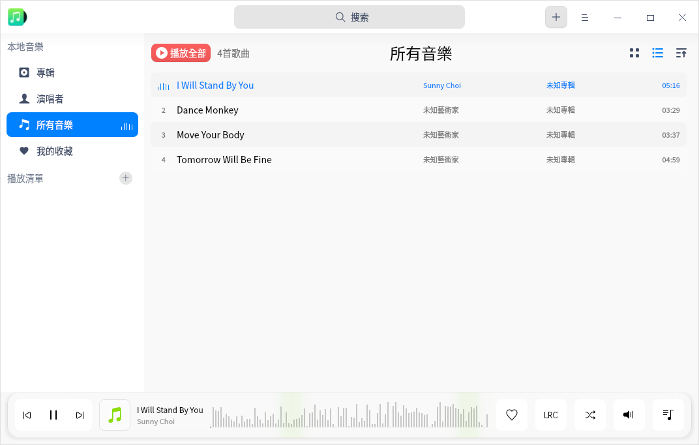

## 使用入門

通過以下方式運行、關閉音樂，同時還可以創建快捷方式。

### 運行音樂

1. 單擊任務欄上的啟動器圖標 ，進入啟動器界面。
2. 上下滾動鼠標滾輪瀏覽或通過搜索，找到音樂圖標  單擊運行。
3. 右鍵單擊 ，您可以：
   - 單擊 **傳送到桌面**，在桌面創建快捷方式。
   - 單擊 **傳送到任務欄**，將應用程序固定到任務欄。
   - 單擊 **加至開機啟動**，將應用程序添加到開機啟動項，在電腦開機時自動運行該應用。

> 說明：如果音樂已經默認固定在任務欄上，您也可以單擊任務欄上的圖標  來運行。

### 隱藏到系統托盤

在音樂界面，單擊  > **設置** ，勾選 **最小化到系統托盤** 後，每次關閉主窗口時，音樂會自動隱藏到系統托盤中。您可以右鍵單擊托盤中的圖標選擇：

- 暫停/繼續。
- 上一首。
- 下一首。
- 離開。

### 關閉音樂

- 在音樂界面，如果您設置關閉主窗口的操作是退出，可以單擊 ，關閉音樂。
- 右鍵單擊系統托盤中的 ，選擇 **離開**，關閉音樂。
- 右鍵單擊任務欄上的 ，選擇 **關閉所有**，關閉音樂。

### 查看快捷鍵

在音樂界面上，使用快捷鍵 **Ctrl + Shift + ?** 打開快捷鍵預覽界面，熟練地使用快捷鍵，將大大提升您的操作效率。

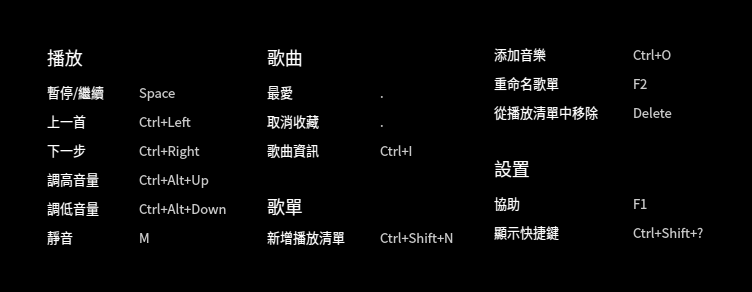

## 界面介紹

通過界面按鈕可以進行常規的播放操作，查看播放列表和歌曲歌詞訊息。

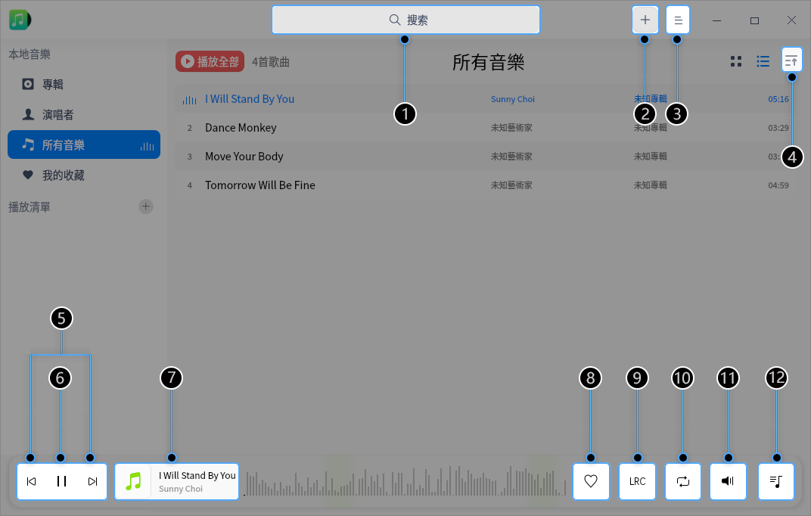

| 標號 | 名稱          | 說明                                                         |
| ---- | ------------- | ------------------------------------------------------------ |
| 1    | 搜索框        | 通過搜索框快速查找音樂。                                     |
| 2    | 主菜單        | 通過菜單欄可以添加新歌單、添加音樂、調節均衡器、設置音樂、查看幫助手冊、退出音樂。 |
| 3    | 排序方式      | 對音樂列表進行排序，排序方式包括：添加時間、歌曲名稱、歌手名稱、專輯名稱。 默認按添加時間排序。 |
| 4    | 上一首/下一首 | 切換到上一首/下一首音樂。                                    |
| 5    | 播放/暫停按鈕 | 播放/暫停歌曲。                                              |
| 6    | 播放框        | 顯示當前播放歌曲名、封面、歌手。                             |
| 7    | 收藏          | 將喜歡的音樂添加到我的收藏列表中，再次單擊可以取消收藏。     |
| 8    | 歌詞          | 切換到歌詞界面，再次單擊收起歌詞界面。                       |
| 9    | 播放模式      | 切換播放模式，包括：列表循環、單曲循環、隨機播放。           |
| 10   | 音量調節      | 調節音量大小。                                               |
| 11   | 播放隊列      | 打開播放隊列。                                               |

## 常用操作

您可以在音樂中對本地音樂進行添加、刪除、查看訊息等基本操作。

### 添加音樂

通過以下方法之一添加音樂到音樂播放器中：
- 在音樂界面，如果還沒有音樂文件，單擊 **添加本地音樂** 選擇本地的音樂文件，或單擊 **掃描** 添加音樂。
- 在音樂界面，如果還沒有音樂文件，單擊 **添加歌曲路徑** 選擇本地的歌曲目錄，批量添加歌曲文件。
- 在音樂界面，選擇  > **新增音樂**。
- 直接將音樂文件/文件夾拖拽到音樂界面。

### 搜索音樂

1. 在音樂搜索框中，單擊 ，輸入關鍵字。   
2. 按下鍵盤上的 **Enter** 鍵進行搜索。
3. 在搜索框中單擊  或刪除輸入的訊息，即可清除當前輸入的訊息或取消搜索。

### 播放音樂

通過以下方法之一播放音樂：

- 在音樂列表，雙擊歌曲或右鍵單擊歌曲並選擇 **播放** ，播放當前歌曲。
- 在音樂列表，單擊 **播放所有**，可以按照當前設置的播放順序播放當前列表中所有歌曲。
- 選擇一個歌單，右鍵單擊 **播放**，按照當前設置的播放順序播放當前歌單中所有歌曲。

> 竅門：在音樂界面，單擊  播放選中的歌曲；單擊  暫停正在播放的歌曲；單擊  或  ，按照當前播放模式切換到上一首或下一首歌曲。

### 收藏音樂

1. 在音樂界面，播放音樂文件。
2. 單擊 ，收藏當前正在播放的音樂到「我的收藏」列表中。

> 說明：您也可以右鍵單擊音樂文件，選擇 **加到播放清單** > **我的收藏**，該音樂會被收藏到“我的收藏”列表中。

### 查看歌詞

在音樂界面，您可以：

- 單擊工具欄上的圖標  切換到歌詞界面，再次單擊，收起歌詞界面。
- 單擊工具欄上的圖標  切換到歌詞界面，再次單擊，收起歌詞界面。

>  說明：如果播放的音樂文件有封面圖，那麼圖標  將轉換為該音樂文件的封面圖，單擊封面圖也可以切換到歌詞界面。

### 調整播放模式

在音樂界面，單擊  或  或  調整播放模式。

其中，

：單曲循環

：隨機播放

：列表循環

### 在檔案管理員顯示

1. 在音樂界面，右鍵單擊音樂文件。
2. 單擊 **在檔案管理員顯示**，定位該音樂的存儲位置。

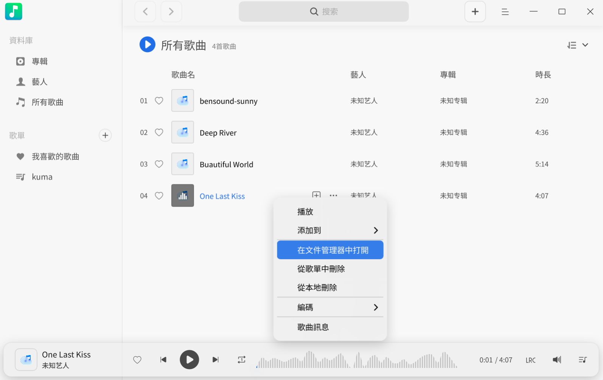

### 刪除音樂

在播放列表中，右鍵單擊要刪除的音樂文件。
- 單擊 **從播放清單中移除**，在彈出的對話框中單擊 **移除**，將該音樂文件從歌曲列表中刪除，但本地文件夾中音樂文件仍會保留。
- 單擊 **從本機儲存刪除**，在彈出的對話框中單擊 **刪除**，將該音樂文件從歌曲列表和本地文件夾中一併刪除。

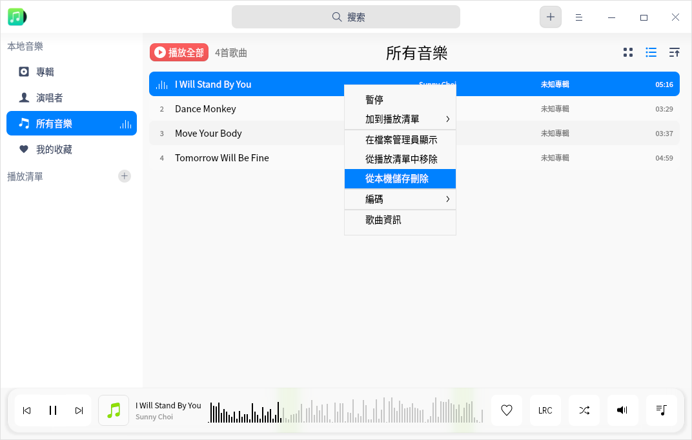

### 設置編碼方式

對有亂碼顯示的歌曲，通過切換編碼方式以使其正常顯示。

1. 在播放列表中，右鍵單擊音樂文件。
2. 單擊 **編碼**，選擇一種編碼方式。

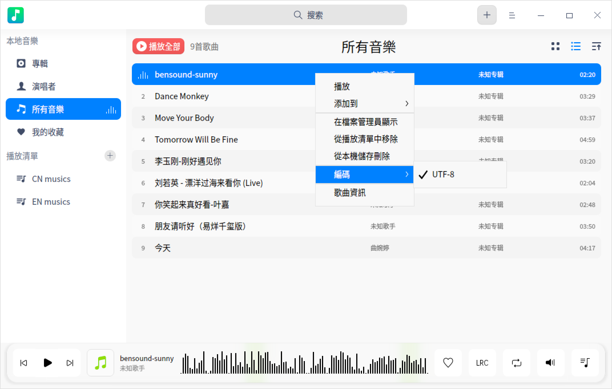

### 查看歌曲資訊

1. 在音樂界面播放列表中，右鍵單擊音樂文件。
2. 單擊 **歌曲資訊**，查看歌曲的詳細資訊。

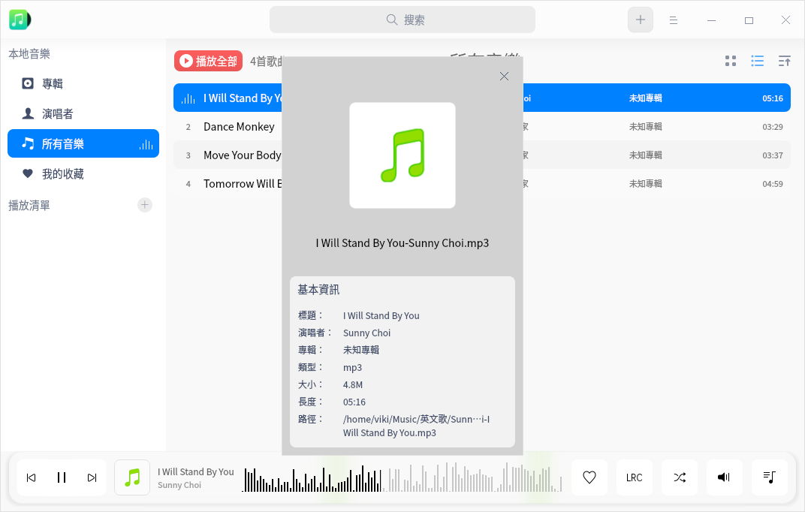

## 歌單管理

您可以在音樂界面進行新建播放清單、重命名清單、刪除清單、將音樂添加到播放清單等操作。

> 說明：**所有音樂** 和 **我的收藏** 是默認列表，不能刪除。**所有音樂** 包含各個歌單的全部音樂。您既可以在 **我的收藏** 列表中直接管理收藏的歌曲，也可以通過主界面上的收藏按鈕管理。

### 新建清單

1. 在音樂界面，單擊「播放清單」右側的按鈕  或者  > **新增播放清單**。
2. 輸入清單名稱後按下鍵盤上的 **Enter** 鍵保存。

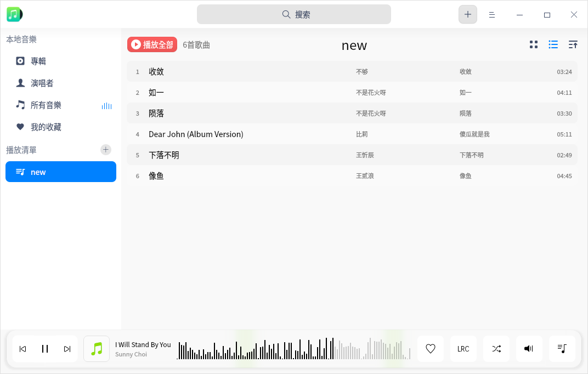

### 重命名清單

1. 在「播放清單」列表中選擇一個清單。
2. 單擊鼠標右鍵，選擇 **重新命名**。
3. 輸入新名稱後按下鍵盤上的 **Enter** 鍵保存。

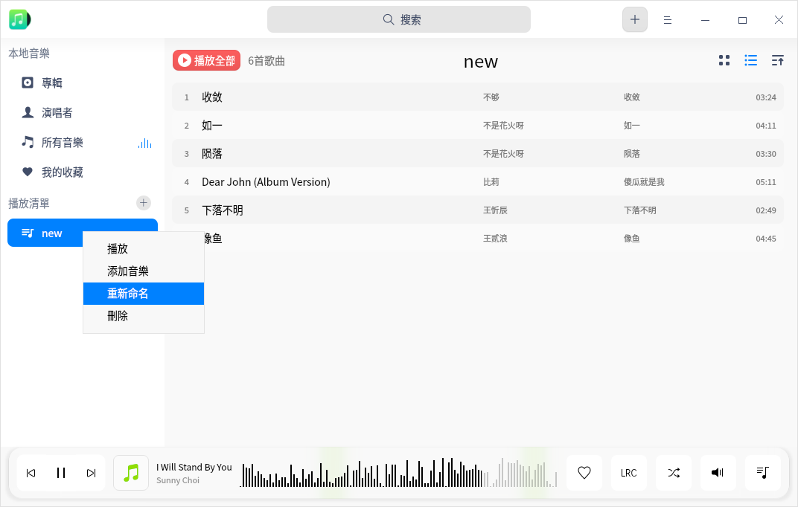

### 添加音樂到播放清單

1. 在音樂界面，選擇一個音樂文件。
2. 單擊鼠標右鍵。
3. 選擇 **加到播放清單**，將歌曲添加到選定的清單。  

> 竅門：您可以拖拽本地歌曲到某一指定清單，即將歌曲添加到了當前清單和所有音樂中。

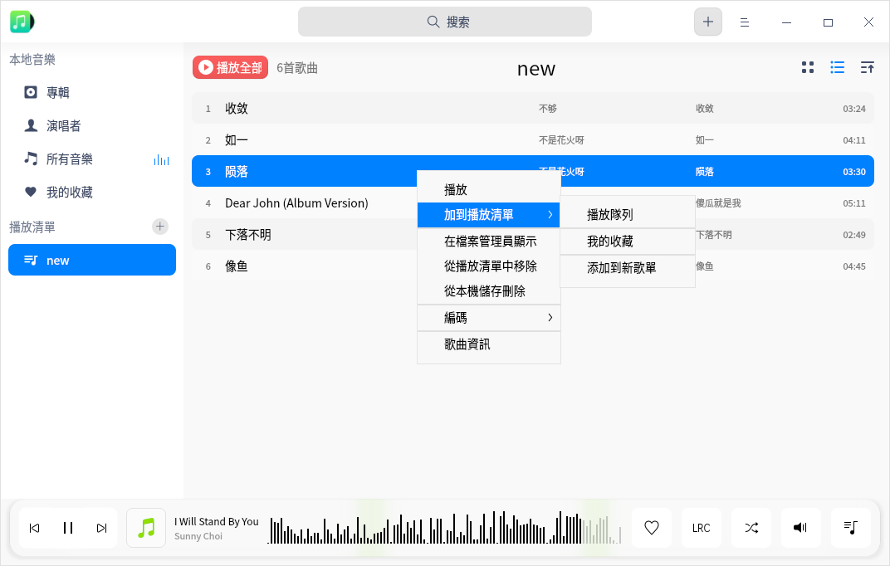

### 移除清單中的音樂

1. 在「播放清單」列表中選擇一個清單，選擇該清單下的音樂文件。
2. 單擊鼠標右鍵。
3. 選擇 **從播放清單中移除**，將選中的音樂文件從清單中移除。

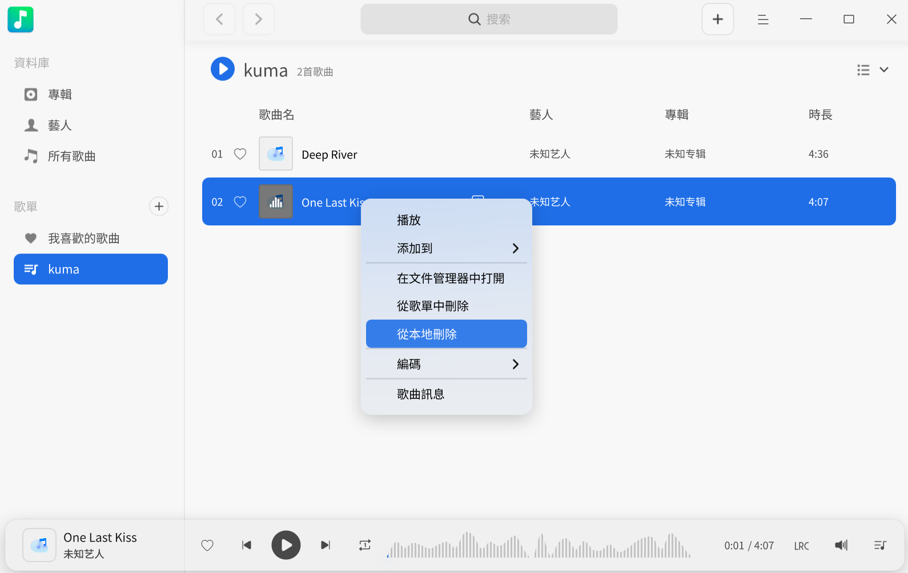

### 刪除歌單

1. 在「播放清單」列表中，選擇要刪除的清單。
2. 單擊鼠標右鍵。
3. 選擇 **刪除**，在彈出的對話框中單擊 **刪除** 來刪除清單。

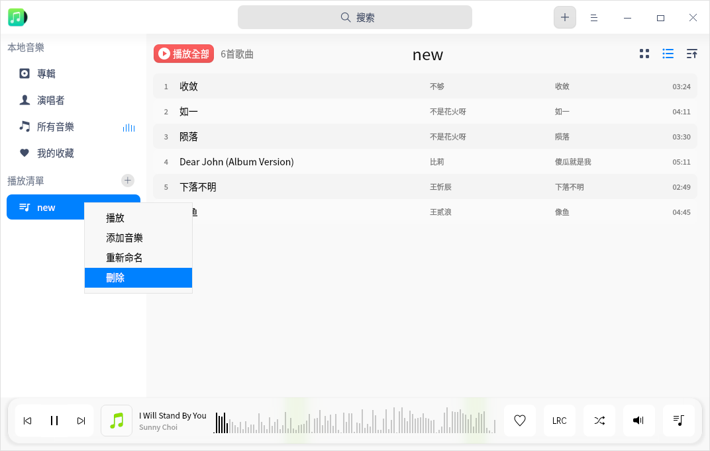

## 主菜單

在主菜單中，您可以 [新增音樂](#添加音樂)、調節均衡器、設置音樂訊息、切換窗口主題、查看幫助手冊，了解音樂的更多訊息。

### 均衡器

您可以在均衡器中調節音頻質量，使其達到理想音效。

1. 在音樂界面，單擊 。
2. 選擇 **均衡器**。
3. 開啟 **均衡器** 後，自定義調節“前置放大”增益值和頻率波段後單擊 **保存**，或者在模式的下拉框中選擇一種音樂模式，系統會自動保存設置。
4. 單擊 **恢復默認**，將設置恢復到默認狀態。

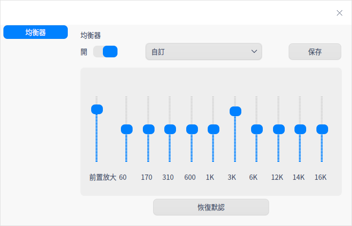

### 設置

音樂播放的基礎訊息設置和快捷鍵設置。

#### 基本設置

1. 在音樂界面，單擊 。
2. 選擇 **設置**。
   - 在 **播放** 選項，您可以：
      - 勾選 **自動播放** 複選框，在音樂啟動後自動播放音樂。
      - 勾選 **記錄播放時間** 複選框，在音樂啟動後接續上次進度播放。
      - 勾選 **開啟淡入淡出** 複選框，播放音樂時聲音緩緩變大，退出音樂時聲音漸漸變小。
   - 在 **關閉主窗口** 選項：
      - 選擇 **最小化到系統托盤**，關閉主窗口時，應用將隱藏到系統托盤。
      - 選擇 **離開**，關閉主窗口時直接退出應用。
      - 選擇 **總是詢問**，每次關閉主窗口時會彈出確認彈窗。
3. 單擊 **恢復默認**，可以將音樂的預設值恢復到默認狀態。

#### 快捷鍵設置

1. 在音樂界面，單擊 。
2. 選擇 **設置**。
3. 在 **快捷鍵** 選項查看當前快捷鍵，也可以自定義快捷鍵。

   

### 主題

窗口主題包含淺色主題、深色主題和系統主題。

1. 在音樂界面，單擊 。
2. 選擇 **主題**，選擇一種主題顏色。

### 幫助

查看幫助手冊，進一步了解和使用音樂。

1. 在音樂界面，單擊 。
2. 選擇 **幫助**。
3. 查看音樂的幫助手冊。

### 關於

1. 在音樂界面，單擊 。
2. 選擇 **關於**。
3. 查看音樂的版本和介紹。

### 退出

1. 在音樂界面，單擊 。
2. 選擇 **退出**。
