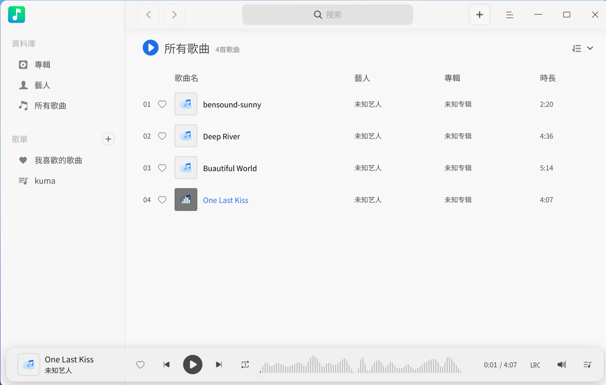
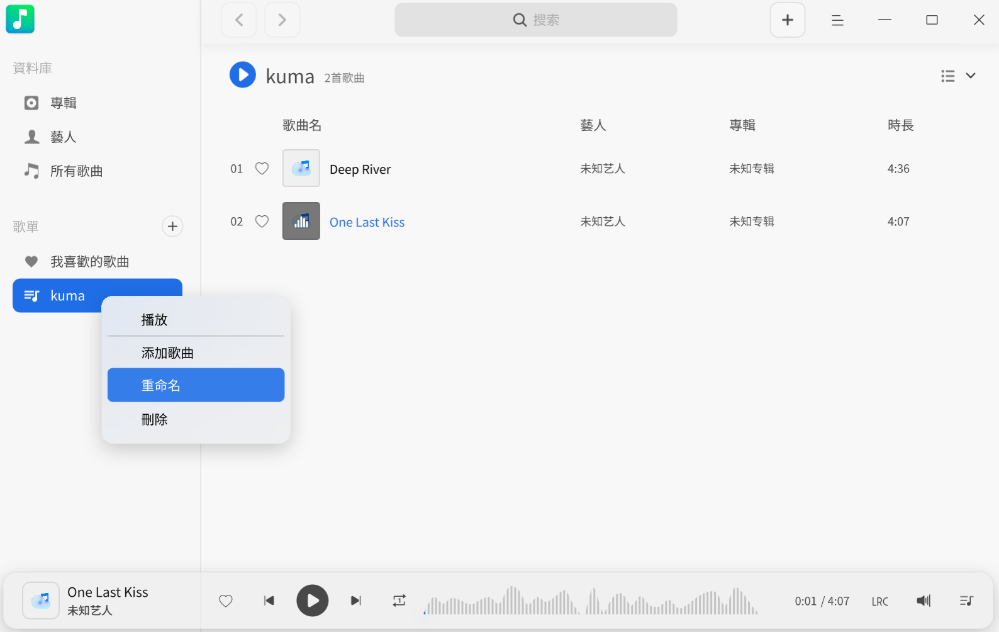

# 音樂|deepin-music|

## 概述

音樂是一款專注於本機音樂播放的應用程式，為您提供全新的介面設計、極致的播放體驗，同時還具有掃描本機音樂、歌詞同步等功能。

## 使用入門

透過以下方式執行、關閉音樂，同時還可以建立捷徑。

### 執行音樂

1. 單擊任務欄上的啟動器圖示  ，進入啟動器介面。
2. 上下滾動滑鼠滾輪瀏覽或透過搜尋，找到音樂  圖示，單擊執行。
3. 右鍵單擊 ，您可以：
   - 單擊 **建立桌面捷徑**，在桌面建立捷徑。
   - 單擊 **釘選到Dock**，將應用程式固定到Dock。
   - 單擊 **開機啟動**，將應用程式添加到開機啟動項，在電腦開機時自動執行該應用。

> 說明：如果音樂已經預設釘選到Dock上，您也可以單擊Dock上的  執行。

### 隱藏到系統匣

在音樂介面，單擊  > **設定** ，勾選 **最小化到系統匣** 後，每次關閉主視窗時，音樂會自動隱藏到系統匣中。您可以右鍵單擊系统匣中的圖示選擇：

- 播放/暫停。
- 上一曲。
- 下一曲。
- 離開。

### 關閉音樂

- 在音樂介面，如果您設定關閉主視窗的操作是離開，可以單擊 ，關閉音樂。
- 右鍵單擊系統匣中的 ，選擇 **離開**，關閉音樂。
- 右鍵單擊Dock上的 ，選擇 **全部關閉**，關閉音樂。

### 查看快捷鍵

在音樂介面上，使用快捷鍵 **Ctrl + Shift + ?** 打開快捷鍵預覽介面。熟練的使用快捷鍵，將大大提升您的操作效率。

## 介面介紹

透過介面按鈕可以進行一般的播放操作，查看播放列表和歌曲歌詞訊息。

| 標號 | 名稱          | 說明                                                         |
| ---- | ------------- | ------------------------------------------------------------ |
| 1    | 搜尋框        | 您可以透過搜尋框快速尋找音樂。                               |
| 2    | 主選單        | 透過選單欄您可以添加新歌單、添加音樂、設定音樂、查看說明手冊、關於音樂、關閉音樂。 |
| 3    | 排序方式      | 可以對音樂列表進行排序，排序方式包括：加入時間、歌曲標題、演唱者名稱、專輯名稱。 預設按加入時間排序。 |
| 4    | 上一曲/下一曲 | 點擊可以切換到上一曲/下一曲音樂。                            |
| 5    | 播放/暫停按鈕 | 播放/暫停播放。                                              |
| 6    | 播放框        | 顯示目前播放歌曲名稱、封面、演唱者名稱。                     |
| 7    | 收藏          | 將喜歡的音樂添加到我的最愛列表中，再次點擊可以取消收藏。     |
| 8    | 歌詞          | 點擊切換到歌詞介面，再次單擊退出歌詞介面。                   |
| 9    | 播放模式      | 點擊切換播放模式，包括：列表循環、單曲循環、隨機播放。       |
| 10   | 音量調節      | 點擊調節播放音量大小。                                       |
| 11   | 播放佇列      | 點擊開啟播放佇列。                                           |

## 常用操作

您可以在音樂中對本機音樂進行添加、刪除、查看訊息等基本操作。

### 添加音樂

透過如下方法添加音樂到音樂播放器中：
- 在音樂介面，如果還沒有音樂檔案，單擊 **加入音樂資料夾**選擇本機的音樂檔案，或單擊單擊 **掃描** 添加音樂。
- 在音樂介面，如果還沒有音樂檔案，單擊 **添加歌曲路徑**選擇本機的歌曲目錄，批次添加歌曲檔案。
- 在音樂介面，單擊  > **加入音樂資料夾**。
- 直接將音樂檔案/資料夾拖曳到音樂介面。

> 說明：當使用觸控屏或觸控板電腦時，一指按住音樂檔案拖曳到音樂介面即可添加音樂。

### 搜尋音樂

1. 在音樂介面頂部搜尋框中，單擊 ，輸入關鍵字。   
2. 按下鍵盤上的 **Enter** 鍵進行搜尋。
3. 在搜尋框中單擊  或刪除輸入的訊息，即可清除目前輸入的訊息或取消搜尋。

### 播放音樂

透過如下方法播放音樂：

- 在音樂列表，雙擊歌曲或右鍵單擊 **播放** ，可以播放目前歌曲。
- 選擇一個歌單，右鍵單擊 **播放**，按照目前設置的播放順序播放目前歌單中所有歌曲。
- 在音樂列表，單擊 **播放所有**，可以按照目前設置的播放順序播放目前列表中所有歌曲。

> 竅門：在音樂介面，單擊  播放選中的歌曲；單擊  暫停正在播放的歌曲；單擊  或 ，按照目前播放模式切換到上一曲或下一曲歌曲。

### 收藏音樂

1. 在音樂介面，播放某一個音樂檔案。
2. 單擊工具列中的 ，收藏目前音樂到「我的最愛」列表中。

> 竅門：您也可以右鍵單擊音樂檔案，選擇 **添加到歌單** > **我的最愛**，該音樂會被收藏到「我的最愛」列表中。

### 查看歌詞

單擊工具列上的  切換到歌詞介面，再次單擊，收起歌詞介面。
單擊工具列上的  切換到歌詞介面，再次單擊，收起歌詞介面。

>  說明：如果播放的音樂檔案有封面圖，那麼 圖示將轉換為該音樂檔案的封面圖，單擊封面圖也可以切換到歌詞介面。

### 調整播放模式

在音樂介面，單擊  或  或  調整播放模式。

其中，

：單曲循環

：隨機播放

：列表循環

### 在檔案管理器中顯示

1. 在音樂介面，右鍵單擊音樂檔案。
2. 選擇 **在檔案管理器中顯示**，定位該音樂的儲存位置。

### 刪除音樂

在播放列表中，右鍵單擊要刪除的音樂檔案：

- 單擊 **從播放列表移除檔案**，將該音樂檔案從歌曲列表中移除，該音樂檔案仍會保留在在本機資料夾中。
- 單擊 **從本機硬碟中移除**，將該音樂檔案從歌曲列表和本機資料夾中一併刪除。

### 設定編碼方式

對亂碼顯示的歌曲，透過切換編碼方式以使其正常顯示。

1. 在播放列表中，右鍵單擊音樂檔案。
2. 單擊 **編碼方式**，選擇一種編碼方式。

### 查看歌曲資訊

1. 在播放列表中，右鍵單擊音樂檔案。
2. 單擊 **歌曲資訊**，查看歌曲標題、演唱者、專輯名稱、檔案類型、檔案大小、歌曲長度、檔案路徑等訊息。

## 我的歌單管理

您可以在音樂介面進行建立歌單、重新命名歌單、移除歌單、將音樂添加到我的歌單等操作。

> 說明：**所有音樂** 和 **我的最愛** 是預設列表，不能刪除。**所有音樂** 包含各個歌單的全部音樂。您既可以在 **我的最愛** 列表中直接管理收藏的歌曲，也可以透過主介面上的收藏按鈕管理。

### 建立歌單

1. 在音樂介面，單擊「我的歌單」右側的  或者  > **新增播放列表**。
2. 輸入歌單的名稱。
3. 按下鍵盤上的 **Enter** 鍵。

### 重新命名歌單

1. 在「我的歌單」中選擇一個歌單。
2. 滑鼠右鍵選擇 **重新命名**，輸入名稱後按下鍵盤上的 **Enter** 鍵儲存。

### 添加音樂到歌單

1. 在音樂介面，選擇一個音樂檔案。
2. 單擊滑鼠右鍵。
3. 選擇 **加入播放列表**，將歌曲添加到選定的歌單。  

> 竅門：您可以拖曳本機歌曲到某以一指定歌單，即將歌曲添加到了目前歌單和所有音樂中。

### 移除歌單中的音樂

1. 在「我的歌單」中選擇一個歌單，選擇該歌單下的音樂檔案。
2. 單擊滑鼠右鍵。
3. 選擇 **從播放列表移除檔案**，將選中的音樂檔案從歌單中移除。

### 刪除歌單

1. 在「我的歌單」中，選擇要刪除的歌單。
2. 單擊滑鼠右鍵，選擇 **刪除**。
3. 在彈出的對話框中單擊 **刪除**，刪除歌單。

## 主選單

在主選單中，您可以[添加音樂](#添加音樂)、建立歌單、調節均衡器、設定音樂資訊、切換視窗主題、查看說明手冊，了解音樂的更多訊息。

### 均衡器

在均衡器中調節音訊品質，使其達到理想的音效。

1. 在音樂介面，單擊 。
2. 單擊 **均衡器**。
3. 開啟 **均衡器** 後，自訂調節「前置放大」增益值和頻率波段單擊 **儲存**，或者在模式的下拉框中選擇一種音樂模式，系統會自動儲存設定。
4. 單擊 **還原至預設值**，將設定還原到預設狀態。

### 設定

#### 基本設定

1. 在音樂介面，單擊 。
2. 單擊 **設定**，您可以進行如下操作。
   - 在 **播放** 選項：
      - 勾選 **啟動時自動播放** 複選框，在音樂啟動後自動播放音樂。
      - 勾選 **記住播放位置** 複選框，在音樂啟動後接續上次進度播放。
      - 勾選 **開啟淡入淡出** 複選框，播放音樂時聲音緩緩變大，退出音樂時聲音漸漸變小。
   - 在 **關閉主視窗** 選項：
      - 選擇 **最小化到系統匣**，關閉主視窗後，應用將隱藏到系統匣中。
      - 選擇 **離開**，關閉主視窗時直接關閉應用。
      - 選擇 **總是詢問**，關閉主視窗時總是彈出確認關閉對話框。
3. 單擊 **還原至預設值**，將音樂的設定復原到預設狀態。

#### 快捷鍵設定

1. 在音樂介面，單擊 。
2. 單擊 **設定**。
3. 在 **快捷鍵** 選項查看目前快捷鍵，您也可以自訂快捷鍵。

### 主題

視窗主題包含亮色主題、暗色主題和系統主題。

1. 在音樂介面，單擊 。
2. 單擊 **主題**，選擇一種主題顏色。

### 說明

查看說明手冊，進一步了解和使用音樂。

1. 在音樂介面，單擊 。
2. 單擊 **說明**。
3. 查看音樂的說明手冊。

### 關於

1. 在音樂介面，單擊 。
2. 單擊 **關於**。
3. 查看音樂的版本和介紹。

### 離開

1. 在音樂介面，單擊 。
2. 單擊 **離開**。
