# Deepin Music|../common/deepin-music.svg|

## Overview|../common/icon_overview.svg|

Deepin Music is a local music playing application with brand new UI design and extreme playing experience developed by Deepin Technology. It's featured with local music scanning and lyric sync functions, etc.

## Guide|../common/icon_guide.svg|

You can run, close and create a shortcut for Deepin Music by the following ways.

### Run Deepin Music

1. Click on  or move the mouse pointer to the upper left corner of the screen to enter Launcher interface.
2. Locate  by scrolling mouse wheel or searching by "deepin music" in Launcher interface.
3. Right click on the Deepin Music application icon, you can
 - Click on **Send to desktop** to create a desktop shortcut.
 - Click on **Send to dock** to fix the application on dock.
 - Click on **Add to startup** to add the application to startup, it will automatically run when the system starts up.

> : If Deepin Music has been fixed on Dock, you can also click on its icon to run.

### Minimize to System Tray

1. On Deepin Music interface, click on , select **Minimize to system tray**.
2. Deepin Music will be minimized to tray;
3. Right click on the Deepin Music application icon in the tray, you can:
 - Click on **Play/Pause** to play/pause the song;
 - Click on **Previous** to play previous song;
 - Click on **Next** to play next song.
 - Click on **Exit** to exit Deepin Music.

### Exit Deepin Music

- On Deepin Music interface, click on , and select  **Exit** to exit Deepin Music.
- Right click on the Deepin Music application icon on Dock, select **Close All** to exit Music.
- Click on  and select **Exit** to exit Deepin Music.

## Main Interface|../common/icon_localmusic.svg|

On the main interface, you can do common playing operations, view playlist and song info.

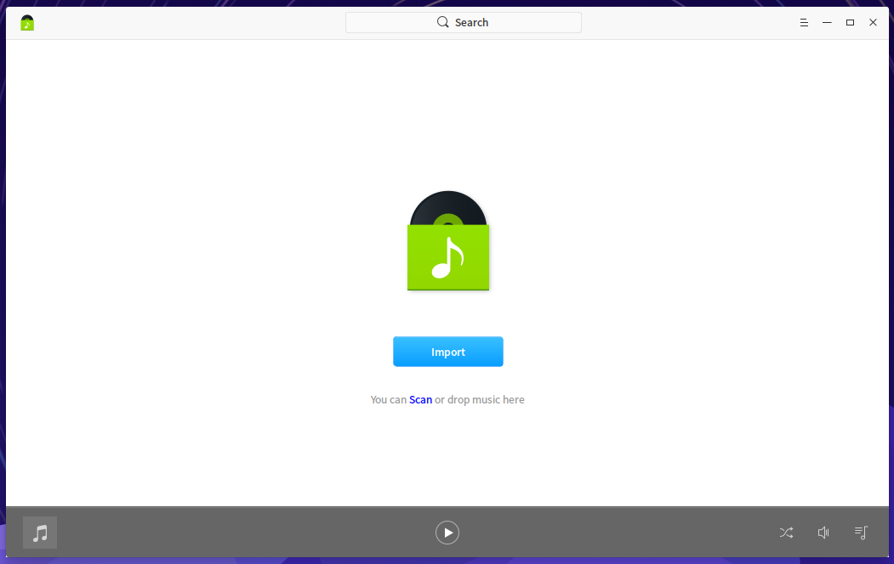

<table class="block1">
    <caption></caption>
    <tbody>
        <tr>
            <td>1</td>
            <td>Search box</td>
            <td>Users can search music quickly by search box.</td>
        </tr>
        <tr>
            <td>2</td>
            <td>Main menu</td>
            <td>Users can add playlist, add music, set options, view manual and  information, and exit the application by main menu.</td>
        </tr>
		<tr>
            <td>3</td>
            <td>Sort options</td>
            <td>Users can sort the list by time added, title, artist or album name.</td>
        </tr>
		<tr>
            <td>4</td>
            <td>Play box</td>
            <td>Show seek bar, cover and album name.</td>
        </tr>
			<tr>
            <td>5</td>
            <td>Play/Pause button</td>
            <td>Click to Play/Pause music.</td>
        </tr>
		<tr>
            <td>6</td>
            <td>Previous/Next</td>
            <td>Click to switch to Previous/Next music.</td>
        </tr>
		<tr>
            <td>7</td>
            <td>My favorites</td>
            <td>Click to add music to my favorites, click again to cancel.</td>
        </tr>
		<tr>
            <td>8</td>
            <td>Lyrics</td>
            <td>Click to switch to the lyrics interface, click again to close lyrics.</td>
        </tr>
			<tr>
            <td>9</td>
            <td>Play mode</td>
            <td>Click to switch the play mode, including repeat playlist, repeat song and shuffle.</td>
        </tr>
			<tr>
            <td>10</td>
            <td>Volume</td>
            <td>Click to Mute/Unmute, move on to show the volume bar to adjust.</td>
        </tr>
			<tr>
            <td>11</td>
            <td>Playlist</td>
            <td>Click to show/hide playlist.</td>
        </tr>
    </tbody>
</table>

## Common Operations|../common/icon_commoncoperat.svg|

You can add, delete and view info of the local music in Deepin Music.

### Add File

On Deepin Music interface, you can: 
- Click on **Add folder** to add a music folder.
- Click on **Scan** to scan music directory.
- Click on  > **Add folder** to add a music folder.
- Click on  > **Add file** to add a music file.

> : You can also drag and drop music file to Deepin Music interface to add.

### Search Music

1. At the top of the Deepin Music interface, click on **Search**.
2. Enter the keywords in search box, then the result will be shown on the interface and you can locate the music quickly.

### Add Music to My Favorites

On Deepin Music interface, click on  to add music to my favorites.

> : You can also right click on the music, and click on **Add to playlist** > **My Favorites** to finish this task.

### Display in File Manager

1. On Deepin Music interface, right click the music.
2. Click on **Display in file manager**, you can view the the music file in Deepin File Manager.

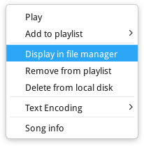

### Delete Music

On Deepin Music interface, right click on the music, you can:
- Click on **Remove from playlist** to remove from the playlist, but the music file will be still on the local disk.
- Click on **Delete from local disk** to remove from the playlist and delete from local disk. There will be a prompt to confirm the operation in the popup window. 

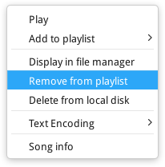

### Encoding

1. On Deepin Music interface, right click the music.
2. Click on **Encoding**, you can select the encoding you want.

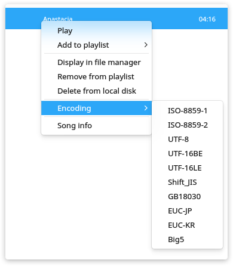

### View Music Info

1. On Deepin Music interface, right click the music.
2. Click on **Song info**, you can view the detailed music information.

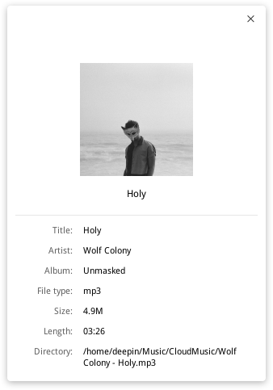

## Playlist Management|../common/icon_playlist.svg|

On Deepin Music interface, you can create, delete, rename playlist and add music to the playlist.

### Create a New Playlist

1. To create a new playlist, you can:
 - Click on , then click on **New playlist**.
 - Click on  to select **New Playlist**.
 - Right click on the music and click on **Add to playlist** > **New playlist**.
2. Enter a name of the playlist.
3. Click on the blank area or press **** key to confirm.

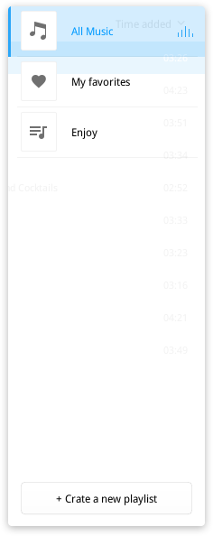

### Rename Playlist

1. On Deepin Music interface, click on .
2. Right click on the playlist to select **Rename**.
3. Enter the name of the playlist.
4. Click on the blank area of the Deepin Music, or press **** key to confirm the name.

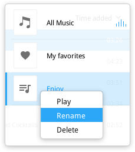

### Add Music to Playlist

1. On Deepin Music interface, select a music you want to add.
2. Right click to select **Add to playlist** > **Playlist name**.

> : You can also select ** New Playlist ** to add the music to a new playlist.

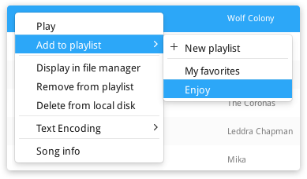

### Remove Music from Playlist

1. On Deepin Music interface, select a music you want to remove.
2. Right click to select **Remove from playlist**.

### Delete Playlist

1. On Deepin Music interface, click on .
2. Right click on the playlist to select **Delete**.
3. In the popup window, select **Delete** to confirm the operation.

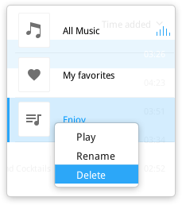

## Main Menu|../common/icon_optionsetting.svg|

You can add new playlists/songs, set the options, view or exit Deepin Music.

### Basic Settings

1. On Deepin Music interface, click on .
2. Select **Settings** > **Basic settings**.
3. In the option **Play**, you can:
 - Check the box of **Autoplay**, the music will be played automatically when Deepin Music runs.
 - Check the box of **Remember playback position**, the music will be played automatically from last positon played when Deepin Music runs.
 - Check the box of **Enable fade**, the music will fade in and out when Deepin Music runs.
4. In the option of **Close Main Window**, you can:
 - Select **Minimize to system tray** to minimize Deepin Music to tray.
 - Select **Exit Deepin Music** to exit.

### Shortcuts Settings

1. On Deepin Music interface, click on .
2. Select **Settings** > **Shortcuts**.
3. Then you can set the shortcuts of Play/Pause, Previous, Next, Volume up and Volume down.

> : You can also click on **Restore Defaults** to restore all settings.

### Switch Theme

The theme of Deepin Music is light, you can click on **Dark theme** to swith.

1. On Deepin Music interface, click on  in the top right corner.

2. Click on **Dark theme** to swith the theme of Deepin Music.

### About

You can click on **About** to view the introduction of Deepin Music.

1. On Deepin Music interface, click on  in the top right corner.

2. Click on **About** to view the introduction of Deepin Music.s

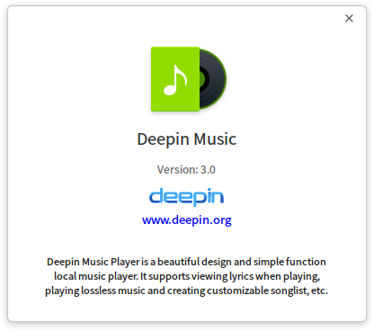

### Help

You can click on **Help** to view the manual.

1. On Deepin Music interface, click on  in the top right corner.

2. Click on **Help** to view the manual of Deepin Music.

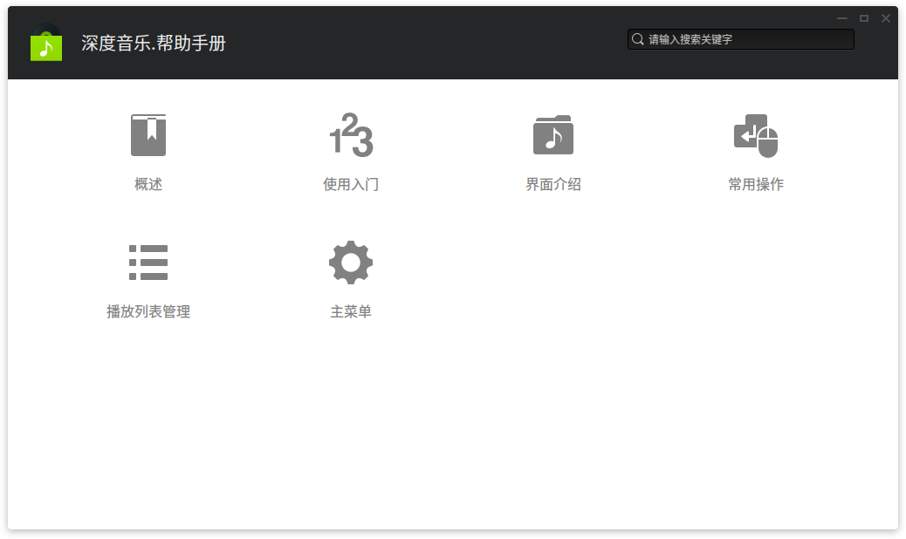

### Exit

You can click on **Exit** to exit Deepin Music.

1. On Deepin Music interface, click on  in the top right corner.

2. Click on **Exit** to exit.
