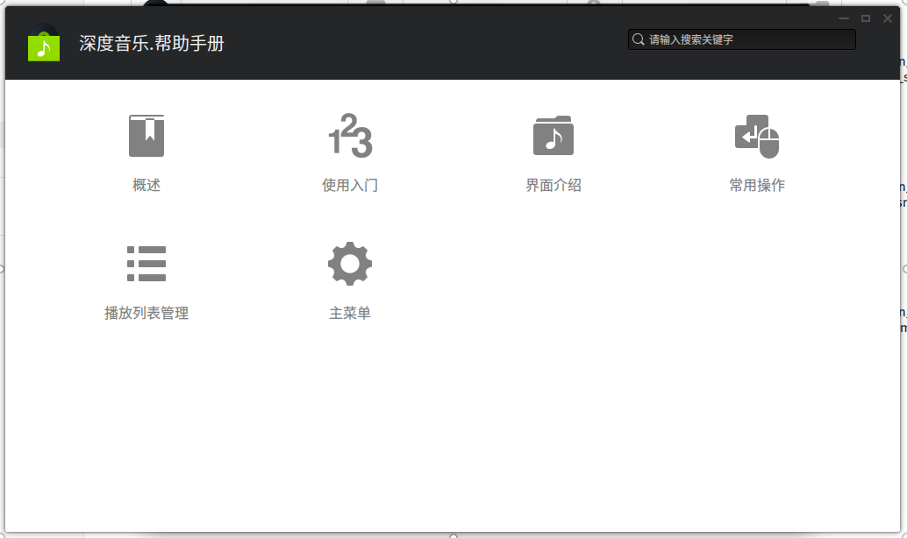
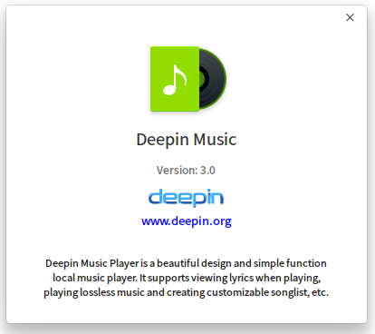

# 深度音乐|../common/deepin-music.svg|

## 概述|../common/icon_overview.svg|

深度音乐是武汉深之度科技有限公司重新打造的一款专注于本地音乐播放的应用程序，为您提供全新的界面设计、极致的播放体验，同时还具有扫描本地音乐、歌词同步等功能。

## 使用入门|../common/icon_guide.svg|

您可以通过以下方式运行、关闭深度音乐，同时还可以创建快捷方式。

### 运行深度音乐

1. 点击桌面底部的  或将鼠标指针移到屏幕左上角，进入启动器界面。
2. 上下滚动鼠标滚轮，通过浏览找到  进行点击运行。
3. 将鼠标指针置于深度音乐应用程序的图标上，右键点击图标，您可以：
  - 点击 **发送到桌面**，在桌面创建快捷方式。
  - 点击 **发送到任务栏**，将应用程序固定到任务栏。
  - 点击 **开机自动启动**，将应用程序添加到开机启动项，在电脑开机时自动运行该应用程序。

> ：如果深度音乐已经默认固定在任务栏上，您也可以点击任务栏上的 应用[icon] 来运行。

### 关闭深度音乐

- 在深度音乐界面，点击 ，退出深度音乐。
- 右键单击任务栏上的 ，选择 **关闭所有**，退出深度音乐。

## 界面介绍|../common/icon_localmusic.svg|

通过界面按钮可以进行常规的播放操作，查看播放列表和歌曲歌词信息。

<table class="block1">
    <caption></caption>
    <tbody>
        <tr>
            <td>1</td>
            <td>搜索框</td>
            <td>用户可以通过搜素框快速查找音乐。</td>
        </tr>
        <tr>
            <td>2</td>
            <td>主菜单</td>
            <td>通过菜单栏您可以新建播放列表、添加音乐、设置深度音乐、查看帮助手册、关于深度音乐、退出深度音乐。</td>
        </tr>
		<tr>
            <td>3</td>
            <td>排序方式</td>
            <td>可以对列表进行排序，排序方式包括：添加时间、歌曲名称、歌手名称、专辑名称。</td>
        </tr>
		<tr>
            <td>4</td>
            <td>播放框</td>
            <td>显示当前播放歌曲名、封面、专辑名。</td>
        </tr>
			<tr>
            <td>5</td>
            <td>播放/暂停按钮</td>
            <td>点击可以开始播放/暂停播放。</td>
        </tr>
		<tr>
            <td>6</td>
            <td>上一首/下一首</td>
            <td>点击可以切换到上一首/下一首音乐。</td>
        </tr>
		<tr>
            <td>7</td>
            <td>收藏</td>
            <td>将喜欢的音乐添加到我的收藏列表中，再次点击可以取消。</td>
        </tr>
		<tr>
            <td>8</td>
            <td>歌词</td>
            <td>点击可以切换到歌词界面，点击歌词界面上的图标可以关闭。</td>
        </tr>
			<tr>
            <td>9</td>
            <td>播放模式</td>
            <td>点击可以切换播放模式，包括：列表循环、单曲循环、随机播放。</td>
        </tr>
			<tr>
            <td>10</td>
            <td>音量调节</td>
            <td>点击调节播放音量大小。</td>
        </tr>
			<tr>
            <td>11</td>
            <td>播放列表</td>
            <td>点击可以打开播放列表菜单。</td>
        </tr>
    </tbody>
</table>

## 常用操作|../common/icon_commoncoperat.svg|

您可以在深度音乐中对本地音乐进行添加、删除、查看信息等基本操作。

### 添加音乐

1. 在深度音乐界面，点击 **添加**或点击鼠标右键。
2. 将鼠标指针置于 **添加音乐** 上，您可以：
  - 点击 **文件**，选择音乐文件进行添加。
  - 点击 **文件夹（包含子目录）**，添加文件夹和其子文件夹目录下的所有音乐文件。
  - 点击 **文件夹**，添加当前文件夹目录下的音乐文件。

### 搜索音乐

1. 在深度音乐界面顶部栏，点击 **搜索**。
2. 在搜索框中，输入关键字后自动匹配，快速定位到该音乐。

### 收藏音乐

1. 在深度音乐界面，点击 。
2. 将音乐默认收藏到我最喜爱的列表中。

> ：您也可以右键单击要收藏的音乐文件，将其收藏到最喜爱的列表中。

### 删除音乐

1. 在深度音乐界面播放列表中，右键单击要删除的音乐文件。
2. 点击 **从播放列表中删除**，将该音乐文件从歌曲列表中删除，该音乐文件仍会保留在在本地文件夹中。
3. 点击 **从本地文件删除**，将该音乐文件从歌曲列表和本地文件夹中一并删除。

### 查看音乐信息

1. 在深度音乐界面播放列表中，右键单击音乐文件。
2. 点击 **属性**，您可以：
 - 在 **歌曲信息** 页签下，查看到歌曲的详细信息和文件存放位置。
 - 在 **编辑标签** 页签下，您可以对歌曲名称、演唱者等信息进行修改。
 - 在 **编辑封面** 页签下，您可以对歌曲的封面进行修改。

### 在文件管理器中显示

1. 在深度音乐界面，右键单击音乐文件。
2. 点击 **在文件管理器中显示**，打开并定位该音乐的存放文件夹位置。

## 播放列表管理|../common/icon_playlist.svg|

您可以在深度音乐界面进行新建列表、删除列表、重命名列表、将音乐添加到播放列表等操作。

### 新建列表

1. 在深度音乐界面，您可以通过以下方式来新建列表：
 - 在默认列表下方的空白处，点击鼠标右键，选择 **新建列表** 。
 - 点击下方的  > **新建列表** 。
2. 输入列表的名称。
3. 点击 **确定**。

### 删除列表

1. 在深度音乐界面，点击 。
2. 在播放列表中，选择要删除的列表。
3. 点击鼠标右键。
4. 点击 **删除列表**。

### 添加音乐到列表

1. 在深度音乐界面，点击 。
2. 在播放列表中，选择要删除的列表。
3. 点击鼠标右键。
4. 点击 **删除列表**。

### 移除列表的音乐

1. 在深度音乐界面，点击 。
2. 在播放列表中，选择要删除的列表。
3. 点击鼠标右键。
4. 点击 **删除列表**。

### 重命名列表

1. 在深度音乐界面，点击 。
2. 在播放列表中，右键单击选中的列表。
3. 点击 **重命名**。
4. 输入新的列表名称。
5. 点击 **确定**。

## 主菜单|../common/icon_optionsetting.svg|

您可以对深度音乐的启动后播放方式、歌词存储、热键自定义等进行设置。

### 常用设置

1. 在深度音乐界面，点击  。
2. 点击 **选项设置**。
3. 在 **当播放器启动时** 选项，您可以：
 - 勾选 **自动播放** 复选框，在深度音乐启动后自动播放音乐。
 - 勾选 **继续上次播放进度** 复选框，在深度音乐启动后接续上次进度播放。

### 热键设置

1. 在深度音乐界面，点击  。
2. 点击 **选项设置**。
3. 在 **快捷键** 选项，勾选 **启用快捷键** 复选框，启用快捷键操作。
4. 自定义所有的快捷键。

### 帮助

您可以点击帮助获取深度音乐的帮助手册，通过帮助进一步让您了解和使用深度音乐。

1. 在深度音乐界面，点击   。
2. 点击 **帮助**。
3. 查看关于深度音乐的帮助手册。

### 关于

您可以点击关于查看深度音乐的版本介绍。

1. 在深度音乐界面，点击   。
2. 点击 **关于**。
3. 查看关于深度音乐的版本和介绍。

### 退出

您可以从菜单栏退出深度音乐。

1. 在深度音乐界面，点击 。
2. 点击 **退出**。
