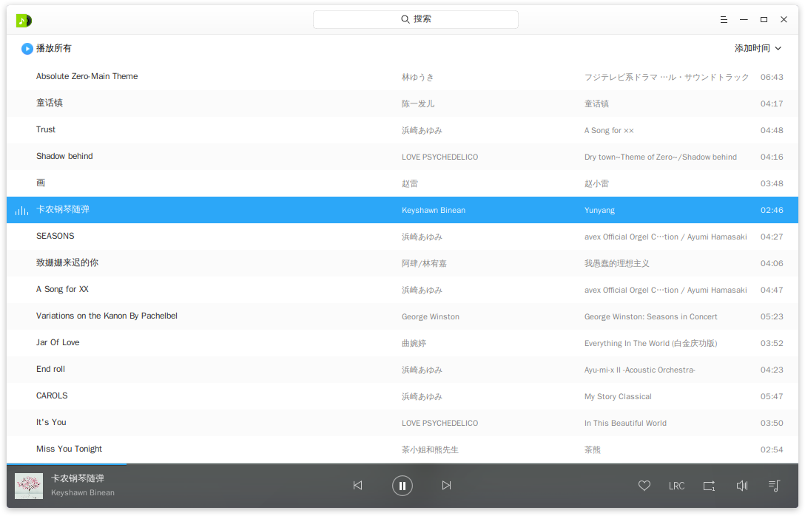
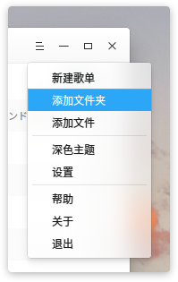
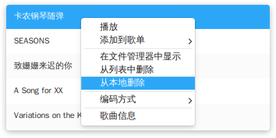
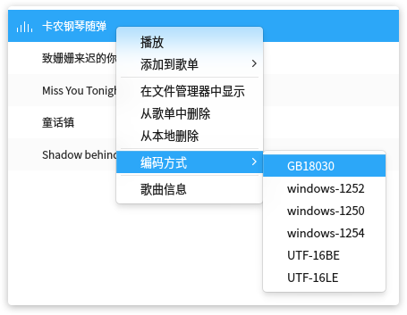
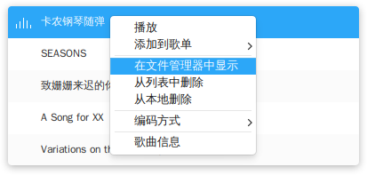
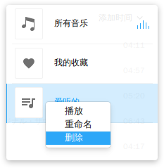
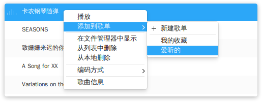
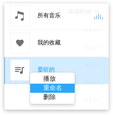
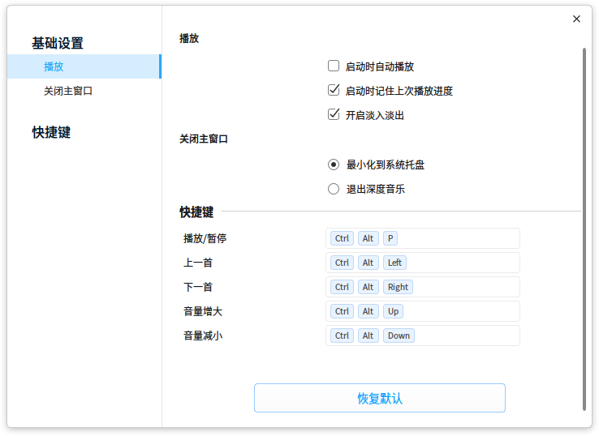
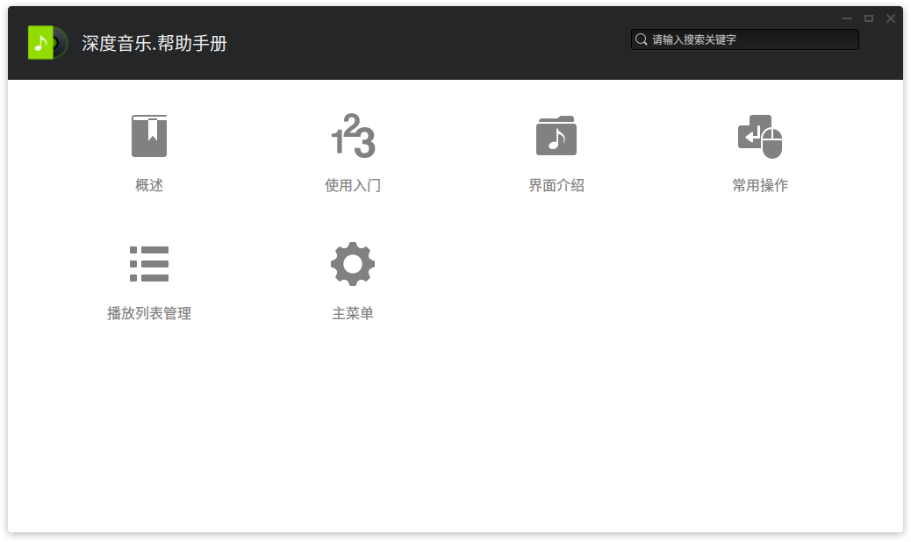

# 深度音乐|../common/deepin-music.svg|

## 概述|../common/icon_overview.svg|

深度音乐是武汉深之度科技有限公司重新打造的一款专注于本地音乐播放的应用程序，为您提供全新的界面设计、极致的播放体验，同时还具有扫描本地音乐、歌词同步等功能。

## 使用入门|../common/icon_guide.svg|

您可以通过以下方式运行、关闭深度音乐，同时还可以创建快捷方式。

### 运行深度音乐

1. 点击桌面底部的  或将鼠标指针移到屏幕左上角，进入启动器界面。
2. 上下滚动鼠标滚轮，通过浏览找到  进行点击运行。
3. 将鼠标指针置于深度音乐应用程序的图标上，右键点击图标，您可以：
  - 点击 **发送到桌面**，在桌面创建快捷方式。
  - 点击 **发送到任务栏**，将应用程序固定到任务栏。
  - 点击 **开机自动启动**，将应用程序添加到开机启动项，在电脑开机时自动运行该应用程序。

> ：如果深度音乐已经默认固定在任务栏上，您也可以点击任务栏上的  来运行。

### 隐藏到系统托盘

深度音乐也可以隐藏到系统托盘中。

- 在深度音乐界面点击  关闭主窗口，在弹窗中选择 **最小化到系统托盘**，然后点击 **确定**。
- 您也可以在 **> 设置 > 关闭主窗口** 中进行设置。

:在弹窗中勾选 **不再提示**，可以不再显示该弹窗。

将深度音乐隐藏到系统托盘之后，您可以右键单击托盘中的 图标选择：

- 暂停/播放 音乐。
- 播放 上一首 音乐。
- 播放 下一首 音乐。
- 退出 深度音乐。

### 关闭深度音乐

- 在深度音乐界面，如果您设置关闭主窗口的操作是退出，可以点击 ，退出深度音乐。
- 右键单击系统托盘中的 ，选择 **退出**，退出深度音乐。
- 右键单击任务栏上的 ，选择 **关闭所有**，退出深度音乐。

## 界面介绍|../common/icon_localmusic.svg|

通过界面按钮可以进行常规的播放操作，查看播放列表和歌曲歌词信息。

<table class="block1">
    <caption></caption>
    <tbody>
        <tr>
            <td>1</td>
            <td>搜索框</td>
            <td>用户可以通过搜素框快速查找音乐。</td>
        </tr>
        <tr>
            <td>2</td>
            <td>主菜单</td>
            <td>通过菜单栏您可以新建播放列表、添加音乐、设置深度音乐、查看帮助手册、关于深度音乐、退出深度音乐。</td>
        </tr>
    	<tr>
            <td>3</td>
            <td>排序方式</td>
            <td>可以对列表进行排序，排序方式包括：添加时间、歌曲名称、歌手名称、专辑名称。</td>
        </tr>
    	<tr>
            <td>4</td>
            <td>播放框</td>
            <td>显示当前播放歌曲名、封面、专辑名。</td>
        </tr>
    		<tr>
            <td>5</td>
            <td>播放/暂停按钮</td>
            <td>点击可以开始播放/暂停播放。</td>
        </tr>
    	<tr>
            <td>6</td>
            <td>上一首/下一首</td>
            <td>点击可以切换到上一首/下一首音乐。</td>
        </tr>
    	<tr>
            <td>7</td>
            <td>收藏</td>
            <td>将喜欢的音乐添加到我的收藏列表中，再次点击可以取消。</td>
        </tr>
    	<tr>
            <td>8</td>
            <td>歌词</td>
            <td>点击可以切换到歌词界面，点击歌词界面上的图标可以关闭。</td>
        </tr>
    		<tr>
            <td>9</td>
            <td>播放模式</td>
            <td>点击可以切换播放模式，包括：列表循环、单曲循环、随机播放。</td>
        </tr>
    		<tr>
            <td>10</td>
            <td>音量调节</td>
            <td>点击调节播放音量大小。</td>
        </tr>
    		<tr>
            <td>11</td>
            <td>播放列表</td>
            <td>点击可以打开播放列表菜单。</td>
        </tr>
    </tbody>
</table>

## 常用操作|../common/icon_commoncoperat.svg|

您可以在深度音乐中对本地音乐进行添加、删除、查看信息等基本操作。

### 添加音乐

您可以通过如下方法添加音乐到深度音乐中：
- 在深度音乐界面，选择 ** > 添加文件夹**，选择文件夹将其中的音乐添加到播放列表。
- 在深度音乐界面，选择 ** > 添加文件**，选择音乐文件将该音乐文件添加到播放列表。
- 直接将音乐文件/文件夹拖拽到深度音乐界面，添加音乐文件到播放列表。
- 如果深度音乐中还没有音乐，您也可以通过界面中间的 **添加文件夹** 或者 **扫描** 按钮来添加音乐到播放列表。

### 搜索音乐

1. 在深度音乐界面顶部栏，点击 **搜索**。
2. 在搜索框中，输入关键字后自动匹配，快速定位到该音乐。

### 收藏音乐

1. 在深度音乐界面，点击 。
2. 将音乐默认收藏到我的收藏列表中。

> ：您也可以右键单击要收藏的音乐文件，将其收藏到我的收藏列表中。

### 删除音乐

1. 在深度音乐界面播放列表中，右键单击要删除的音乐文件。
2. 点击 **从播放列表中删除**，将该音乐文件从歌曲列表中删除，该音乐文件仍会保留在在本地文件夹中。
3. 点击 **从本地文件删除**，将该音乐文件从歌曲列表和本地文件夹中一并删除。

### 查看音乐信息

1. 在深度音乐界面播放列表中，右键单击音乐文件。
2. 点击 **属性**，您可以查看歌曲的歌手、所属专辑、文件类型、大小、时长、存储路径等信息。

### 调整编码方式
当某些音乐文件信息显示乱码或者错误时，可以通过调整编码方式来解决问题。

1. 在深度音乐界面播放列表中，右键单击音乐文件。
2. 选择 **编码方式** > **一种编码方式**。
3. 查看音乐信息是否已显示正确，如果仍然有问题请重复第2步选择其他编码方式。

### 在文件管理器中显示

1. 在深度音乐界面，右键单击音乐文件。
2. 点击 **在文件管理器中显示**，打开并定位该音乐的存放文件夹位置。

## 播放列表管理|../common/icon_playlist.svg|

您可以在深度音乐界面进行新建列表、删除列表、重命名列表、将音乐添加到播放列表等操作。

> ：**所有音乐** 和 **我的收藏** 是默认列表，不能删除。自定义的播放列表都是 **所有音乐** 列表的子集。**我的收藏** 列表既可以直接管理也可以通过主界面上的收藏按钮管理。

### 新建列表

1. 在深度音乐界面，点击   打开播放列表界面。
2. 点击下方的 **新建列表** 。
3. 输入列表的名称。
4. 按下键盘上的  键。

### 删除列表

1. 在深度音乐界面，点击 。
2. 在播放列表中，选择要删除的列表。
3. 点击鼠标右键。
4. 点击 **删除列表**。

### 添加音乐到列表

1. 在深度音乐界面，选择一个音乐。
2. 点击鼠标右键。
3. 选择 **添加到歌单** > **歌单名称**。

### 移除列表的音乐

1. 在深度音乐界面，选择一个音乐。
2. 点击鼠标右键。
3. 选择 **从列表中删除**。

### 重命名列表

1. 在深度音乐界面，点击 。
2. 在播放列表中，右键单击播放列表。
3. 选择 **重命名**。
4. 按下键盘上的 **** 键。

## 主菜单|../common/icon_optionsetting.svg|

您可以对深度音乐的启动后播放方式、歌词存储、热键自定义等进行设置。

### 切换主题

1. 在深度看图界面，点击  。
2. 点击 **浅色主题/深色主题**，来切换主题颜色。

### 常用设置

1. 在深度音乐界面，点击  。
2. 点击 **选项设置**。
3. 在 **播放** 选项，您可以：
 - 勾选 **自动播放** 复选框，在深度音乐启动后自动播放音乐。
 - 勾选 **继续上次播放进度** 复选框，在深度音乐启动后接续上次进度播放。
 - 勾选 **开启淡入淡出** 复选框，开启窗口特效。
4. 在 **关闭主窗口** 列表中，选择 **最小化到系统托盘** 或者 **退出深度音乐** 来设置关闭主窗口的默认操作。
5. 点击 **恢复默认设置**，可以将深度音乐的设置恢复到默认状态。

### 热键设置

1. 在深度音乐界面，点击  。
2. 点击 **选项设置**。
3. 在 **快捷键** 选项，勾选 **启用快捷键** 复选框，启用快捷键操作。
4. 自定义所有的快捷键。

### 帮助

您可以点击帮助获取深度音乐的帮助手册，通过帮助进一步让您了解和使用深度音乐。

1. 在深度音乐界面，点击   。
2. 点击 **帮助**。
3. 查看关于深度音乐的帮助手册。

### 关于

您可以点击关于查看深度音乐的版本介绍。

1. 在深度音乐界面，点击   。
2. 点击 **关于**。
3. 查看关于深度音乐的版本和介绍。

### 退出

您可以从菜单栏退出深度音乐。

1. 在深度音乐界面，点击 。
2. 点击 **退出**。
